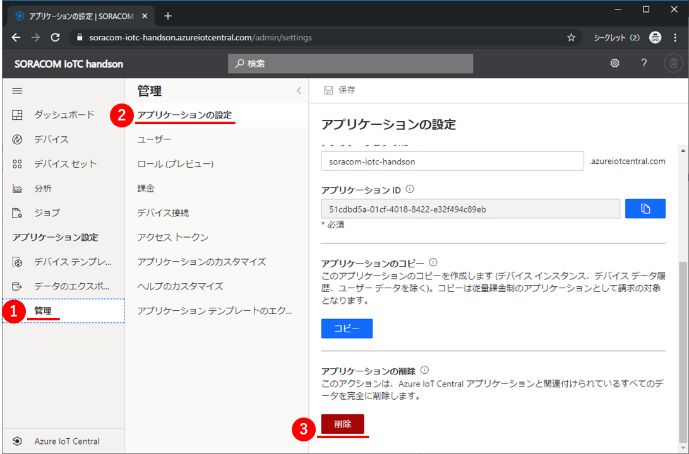

# 0. おわりに - Azure IoT Central

おつかれさまでした  
Wio LTE ハンズオンは以上で終了です。最後に注意点の確認をお願いいたします

## 《知識》今後の費用について

Azure IoT Centralは、デバイス5台までは無料です。

そのため、今回作成したAzure IoT Centralアプリケーションを削除する必要はありませんが、気になる方は、下記手順でアプリケーションを削除することも可能です。

## Azure IoT Centralアプリケーションの削除方法

Azure IoT Central上で、左の①`管理`をクリックして、②`アプリケーションの設定`にある、③`削除`をクリックすると、アプリケーションがごっそりと削除できます。

## Cloud Shell を使った場合の費用

Cloud Shell は、Cloud Shell の料金は、データを維持するのに使用される Azure Files 共有のみに基づいています。
今後の利用が不要であれば、Cloud Shell の利用する Azure Files Storage を削除します。
[Azure Portal](https://portal.azure.com) よりストレージアカウント一覧を確認し、`cloud-shell-storage-リージョン名`のリソースグループに所属しているストレージアカウントを削除すれば完了です。

* [目次ページへ戻る](../index.md)
