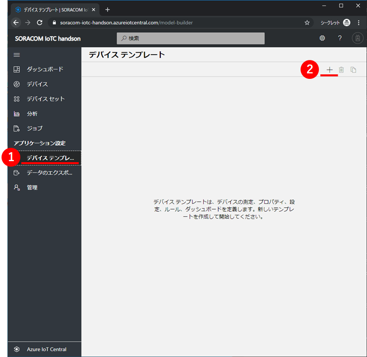
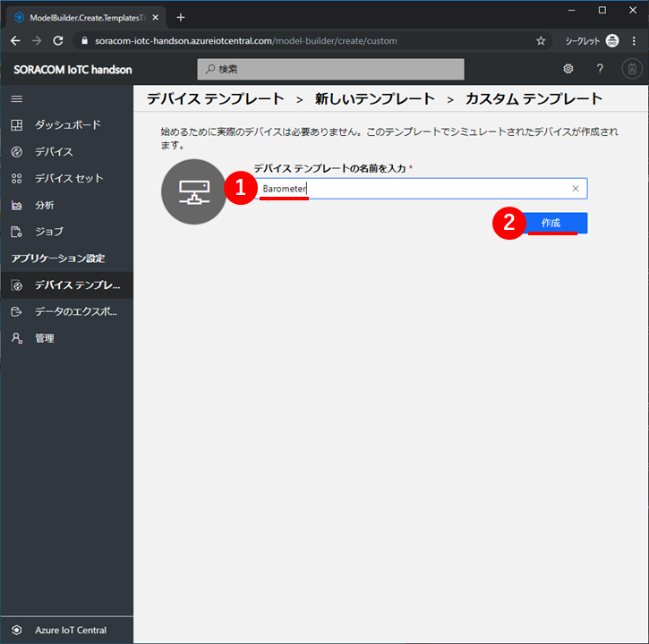
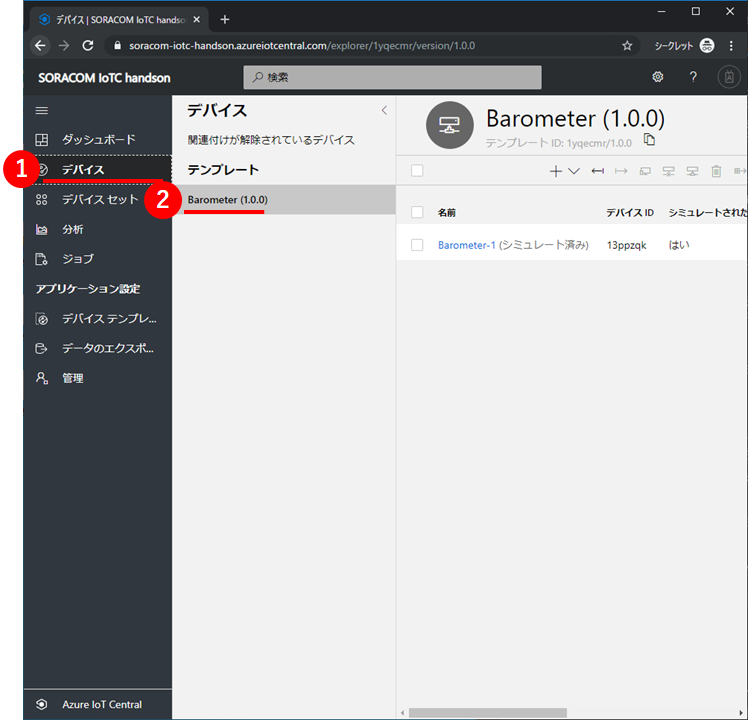
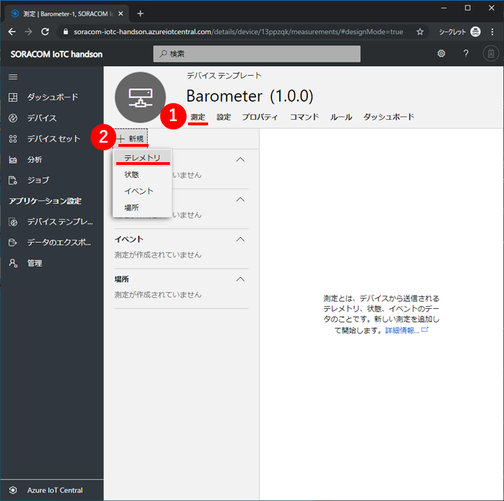
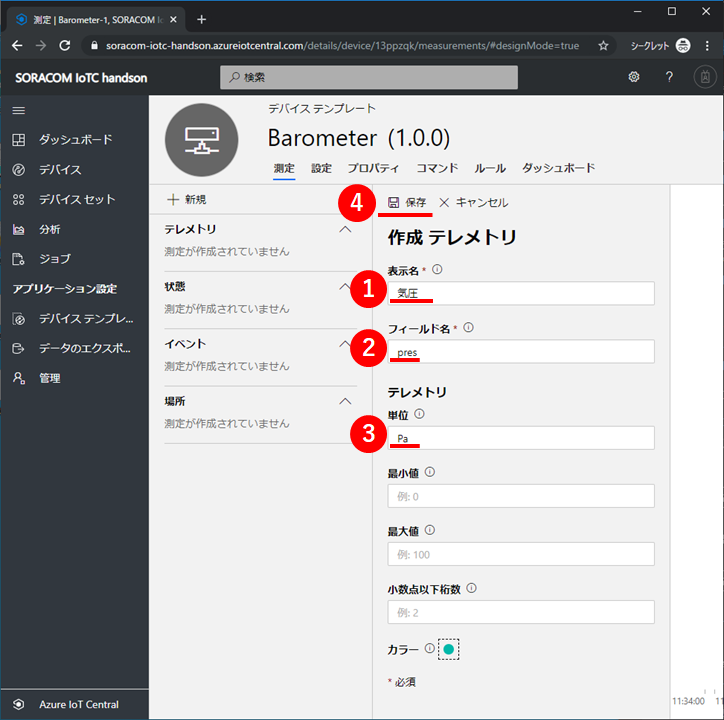

# 2-1.絶対圧センサーのデータを Azure IoT Central で可視化 (IoTC の設定)

絶対圧センサーのデータを Azure IoT Central (以下、IoTC) で可視化してみましょう

## <a name="1">1. IoTC :  アプリケーションを作成</a>

Webブラウザで`https://aka.ms/iotcentral`を開いて、左側のメニューの①`Build`をクリックしてから、②`Custom app`をクリックしてください。


Azure IoT Centralのサインイン画面が表示された場合は、
Azureサブスクリプションに紐づいたMicrosoftアカウントを使って、サインインしてください。

次に、アプリケーションの作成に必要な情報を設定します。  
下表のとおり設定して、最後に⑧`Create`をクリックしてください。

|項目名|値|備考|
|:--|:--|:--|
|①Application Name|==任意==|SORACOM IoTC handson|
|②URL|==ユニークURL==|同じURLが既に存在するとエラーになります|
|③Application template|カスタムアプリケーション||
|④7 day free trial|OFF||
|⑤Directory|==任意==||
|⑥Azure subscription|==任意==|(※)|
|⑦Region|Asia Pacific|

※）従量課金を選択してもこのコンテンツの実施による課金は発生しません。


しばらくすると、アプリケーションが作成されて、ダッシュボードが表示されます。  
黄色いポップアップが表示されている場合は、①`OK, I got it`をクリックして、表示を消してください。


表示言語を日本語にしておきましょう。  
右上の①`歯車マーク`をクリック、Languageを②`日本語`にして、③`Save`をクリックしてください。


---

## <a name="2">2. IoTC : デバイステンプレートを作成</a>

左の①`デバイステンプレート`をクリックしてください。デバイステンプレートの一覧が表示されます。  
ここで、右上の②[`+`]マークをクリックして、デバイステンプレートを作成してください。  
この時、「アプリケーションはまだプロビジョニング中」という表示が出た場合には少し待ってから再度試してみてください。



デバイステンプレートの種類は①`カスタム`を選択してください。


デバイステンプレートの名前に①`Barometer`と入力して、②`作成`をクリックしてください。



左の①`デバイス`をクリックしてください。  
②`Barometer (1.0.0)`という名前のデバイステンプレートが表示されて、`Barometer(シミュレート済み)`という名前のデバイスが1つ含まれていることを確認してください。



---

## <a name="3">3. IoTC : 測定に気圧・温度テレメトリを追加</a>

①`デバイステンプレート`をクリックして、②`Barometer`デバイステンプレートをクリックしてください。


デバイステンプレートの①`測定`タブ画面が表示されます。  
②`新規` > `テレメトリ`をクリックしてください。測定の追加画面が表示されます。



次に、測定の追加に必要な情報を設定します。  
下表のとおり設定して、最後に④`保存`をクリックしてください。

|項目名|値|備考|
|:--|:--|:--|
|①表示名|気圧||
|②フィールド名|pres|**必ず、この値にしてください**|
|③単位|Pa||

同様に温度のテレメトリも追加します。

|項目名|値|備考|
|:--|:--|:--|
|①表示名|温度||
|②フィールド名|temp|**必ず、この値にしてください**|
|③単位|℃||




次の画像のとおり、テレメトリに**表示名**の測定項目が追加されていることを確認してください。


## <a name="4">4. IoTC : デバイスを追加</a>

左の①`デバイス`をクリックしてください。②`Barometer (1.0.0)`デバイステンプレートに含まれているデバイスが一覧表示されます。  
ここで、上にある③[`+`]マークをクリックして、④`実際`を選択してください。


①`デバイス名`に**必ず** `wiolte` と入力して、②`作成`をクリックしてください。


すると、作成した Wio LTE デバイスが表示されます。  
右上の①`接続`をクリックして、このデバイスの接続情報を表示してください。


この内容は次の手順で使いますので**メモ帳などにコピー**しておいてください。


## <a name="5">5. SORACOM Beam 用の接続情報を作成</a>

1. [Azure CLI](https://shell.azure.com) または bash が利用できるターミナルを開きます。
2. 以下の コマンドでスクリプトをダウンロードします。  
`curl -O https://gist.githubusercontent.com/j3tm0t0/b5bd4cf95aee4abca9f73b43d3935a3f/raw/20d57ac66bee595eee20396e9cc463cc54b823ce/register.sh`
3. 以下のコマンドで SORACOM Beam 用の接続情報を作成します。
`bash ./register.sh [スコープID] [デバイスID] [主キー]`
4. 以下の例ように出力される内容は次の手順で使いますので**メモ帳などにコピー**しておいてください。

```
SORACOM Beam Setting
- MQTT entry point
  Type: Azure IoT Hub
  Protocol: MQTTS
  Host name: iotc-003580fa-90ef-4204-85bf-xxxxxxxxxxxx.azure-devices.net
  Port number: 8883
- Credentials
  Credentials set ID: 0ne00xxxxxx-wiolte
  Description: Device wiolte in Scope 0ne000828AD
  Type: Azure IoT credentials
  Access Policy name: (blank)
  Shared access key: Au1Aqjr+zElOc8f8kqave5W+Pd9IozPxxxxxxxxxxxx=
```

## 以上で本章は終了です

達成状況を運営表へご記入ください。

* [2-2.絶対圧センサーのデータを Azure IoT Central で可視化 (SORACOM の設定)](2-soracom-beam+azure-iot-central-SORACOM.md) に進んで下さい
* [目次ページへ戻る](../index.md)
