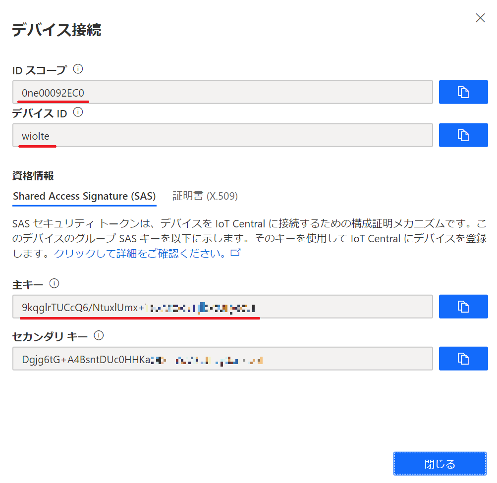

# 2-1. 絶対圧センサーのデータを Azure IoT Central で可視化

絶対圧センサーのデータを Azure IoT Central (以下、IoTC) で可視化してみましょう

### <a name="2-1-1">2-1-1 IoTC :  アプリケーションを作成</a>

Webブラウザで`https://aka.ms/iotcentral`を開いて、左側のメニューの①`Build`をクリックしてから、②`Custom app`をクリックしてください。


Azure IoT Centralのサインイン画面が表示された場合は、
Azureサブスクリプションに紐づいたMicrosoftアカウントを使って、サインインしてください。

次に、アプリケーションの作成に必要な情報を設定します。  
下表のとおり設定して、最後に⑧`Create`をクリックしてください。

|項目名|値|備考|
|:--|:--|:--|
|①Application Name|==任意==|SORACOM IoTC handson|
|②URL|==ユニークURL==|同じURLが既に存在するとエラーになります|
|③Application template|Custom application||
|④7 day free trial|OFF||
|⑤Directory|==任意==||
|⑥Azure subscription|==任意==|(※)|
|⑦Region|Asia Pacific|

※）従量課金を選択してもこのコンテンツの実施による課金は発生しません。


しばらくすると、アプリケーションが作成されて、ダッシュボードが表示されます。  
黄色いポップアップが表示されている場合は、①`OK, I got it`をクリックして、表示を消してください。


表示言語を日本語にしておきましょう。  
右上の①`歯車マーク`をクリック、Languageを②`日本語`にして、③`Save`をクリックしてください。


---

### <a name="2-1-2">2-1-2 IoTC : デバイステンプレートを作成</a>

左の①`デバイステンプレート`をクリックしてください。デバイステンプレートの一覧が表示されます。  
ここで、右上の②[`+`]マークをクリックして、デバイステンプレートを作成してください。  
この時、「アプリケーションはまだプロビジョニング中」という表示が出た場合には少し待ってから再度試してみてください。


デバイステンプレートの種類は①`カスタム`を選択してください。


デバイステンプレートの名前に①`Barometer`と入力して、②`作成`をクリックしてください。


左の①`デバイス`をクリックしてください。  
②`Barometer (1.0.0)`という名前のデバイステンプレートが表示されて、`Barometer(シミュレート済み)`という名前のデバイスが1つ含まれていることを確認してください。


---

### <a name="2-1-3">2-1-3 IoTC : 測定に気圧・温度テレメトリを追加</a>

①`デバイステンプレート`をクリックして、②`Barometer`デバイステンプレートをクリックしてください。


デバイステンプレートの①`測定`タブ画面が表示されます。  
②`新規` > `テレメトリ`をクリックしてください。測定の追加画面が表示されます。


次に、測定の追加に必要な情報を設定します。  
下表のとおり設定して、最後に④`保存`をクリックしてください。

|項目名|値|備考|
|:--|:--|:--|
|①表示名|気圧||
|②フィールド名|pres|**必ず、この値にしてください**|
|③単位|Pa||

同様に温度のテレメトリも追加します。

|項目名|値|備考|
|:--|:--|:--|
|①表示名|温度||
|②フィールド名|temp|**必ず、この値にしてください**|
|③単位|℃||


次の画像のとおり、テレメトリに**表示名**の測定項目が追加されていることを確認してください。


### <a name="2-1-4">2-1-4 IoTC : デバイスを追加</a>

左の①`デバイス`をクリックしてください。②`Barometer (1.0.0)`デバイステンプレートに含まれているデバイスが一覧表示されます。  
ここで、上にある③[`+`]マークをクリックして、④`実際`を選択してください。


①`デバイス名`に**必ず** `wiolte` と入力して、②`作成`をクリックしてください。


すると、作成した Wio LTE デバイスが表示されます。  
右上の①`接続`をクリックして、このデバイスの接続情報を表示してください。


この内容は次の手順で使いますので**メモ帳などにコピー**しておいてください。



### <a name="2-1-5">2-1-5 SORACOM Beam 用の接続情報を作成</a>

1. [Azure CLI](https://shell.azure.com) または bash が利用できるターミナルを開きます。
2. 以下の コマンドでスクリプトをダウンロードします。  
`wget https://gist.githubusercontent.com/j3tm0t0/b5bd4cf95aee4abca9f73b43d3935a3f/raw/7ae5b041e6d1a233445c84a28c5b634c85a641a2/register.sh`
3. 以下のコマンドで SORACOM Beam 用の接続情報を作成します。
`bash ./register.sh [スコープID] [デバイスID] [主キー]`
4. 以下の例ように出力される内容は次の手順で使いますので**メモ帳などにコピー**しておいてください。

```
SORACOM Beam Setting
- MQTT entry point
  Type: Azure IoT Hub
  Protocol: MQTTS
  Host name: iotc-003580fa-90ef-4204-85bf-xxxxxxxxxxxx.azure-devices.net
  Port number: 8883
- Credentials
  Credentials set ID: 0ne00xxxxxx-wiolte
  Description: Device wiolte in Scope 0ne000828AD
  Type: Azure IoT credentials
  Access Policy name: (blank)
  Shared access key: Au1Aqjr+zElOc8f8kqave5W+Pd9IozPxxxxxxxxxxxx=
```

### <a name="2-1-6">2-1-6 SORACOM Beam を設定</a>

### 2-1-6-1. [SORACOM Web コンソール](https://console.soracom.io/) で 左上[Menu] > [SIM グループ]

[追加] で、SIMグループを作成します。グループ名は任意です。

### 2-1-6-2. 先ほど作成した SIMグループ をクリックし、 SORACOM Beam の設定を開きます

### 2-1-6-3. SORACOM Beam の「＋」をクリックし、一覧の中から **MQTT エントリポイント** をクリック


### 2-1-6-4. SORACOM Beam の設定では、下記の通り入力します

* 設定名: `to-IoTC`
* 種別: *Azure IoT Hub*
* プロトコル: *MQTTS* (変更し忘れが多いので注意)
* ホスト名: **2-1-5 でメモ帳にコピーした値 (Host name)**
* ポート番号: **8883**
* その他: **空欄**


### 2-1-6-5. 「認証情報」横の「+」を選択し、下記の通り入力し、登録してください。その後、SORACOM Beam の設定も保存します。

* 認証情報 ID: **2-1-5 でメモ帳にコピーした値 (Credentials set ID)**
* 概要: **2-1-5 でメモ帳にコピーした値 (Description)**
* Access Policy name: **空欄**
* Shared access key: **2-1-5 でメモ帳にコピーした値 (Shared access key)**


### 2-1-6-6. SIM を作成したグループに登録させます

* 左上[Menu] > [SIM 管理]
* Wio LTE に取り付けている SIM を選択 > [操作] > [所属グループ変更]
* 先ほど作成した SIMグループ に所属させます。SORACOM Beam 経由で IoTC へデータを送れるようになります。

### 2-1-7. Wio LTE にスケッチを設定

### 2-1-7-1. PubSubClient ライブラリのインストール

MQTT 通信を行うにあたり PubSubClient というライブラリを利用します  
※ 公式の PubSubClient では、パケットサイズが小さいため若干不都合が発生することが確認されています。そのため、ハンズオン側で準備した fork ライブラリを使用してください

### 2-1-7-2. 追加のライブラリをダウンロードする

[SeeedJP/pubsubclient](https://github.com/SeeedJP/pubsubclient/releases) のページから **2.6 の ZIP** をダウンロードします

### 2-1-7-3. Arduino IDE を起動する

### 2-1-7-4. Arduino IDE の [スケッチ] > [ライブラリをインクルード] > [.ZIP 形式のライブラリをインストール...]


先ほどダウンロードした `pubsubclient-2.6.zip` を探して「開く」をクリックすればインストール完了です

## 2-1-8. スケッチを作成する

### 2-1-8-1. Arduino IDE を起動する

### 2-1-8-2. メニューの [ツール] で [ボード: "Seeed Wio LTE Cat.1"] と表示されていることを確認する

なっていなければ一覧から "Seeed Wio LTE Cat.1" を選んでください

### 2-1-8-3. スケッチをダウンロードする

Arduino IDE で [ファイル] > [新規ファイル] で新しいスケッチを開き、全て削除して何も書かれていない状態にします。

以下の URL を開き、表示されたスケッチをコピーして Arduino IDE にペーストします。

[https://raw.githubusercontent.com/algyan/SORACOM/master/sketch/mqtt-client-beam-azure_omron.ino](https://raw.githubusercontent.com/algyan/SORACOM/master/sketch/mqtt-client-beam-azure_omron.ino)

### 2-1-9. Wio LTE を PC を接続して DFUモード にする

### 2-1-10. 新しく開いたウィンドウの (マイコンボードに書き込む) をクリック

スケッチ名を保存するように言われるので、任意の名前をつけてください。

### 2-1-11. 書き込みが完了したら、Wio LTE を 通常モードにする (RSTボタンを押せば通常モードになります)

通常モードで起動次第 SORACOM Beam へデータを送信し始めます (電源投入から送信開始までは15~20秒程度かかります)

### <a name="2-1-12">2-1-12 データの確認</a>

IoTC でデバイスから送信されたデータを確認します。TBD

以上で本章は終了です。

* [3-1. 気圧上昇でEメール通知](3/1)へ進んでください。
* [目次ページへ戻る](../index)
