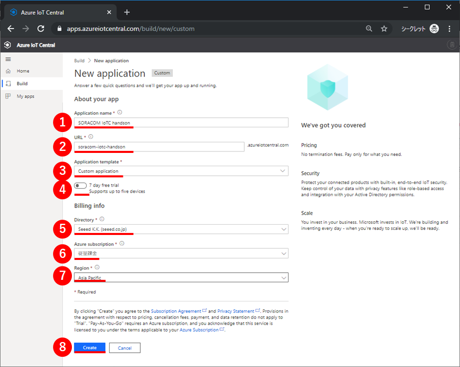
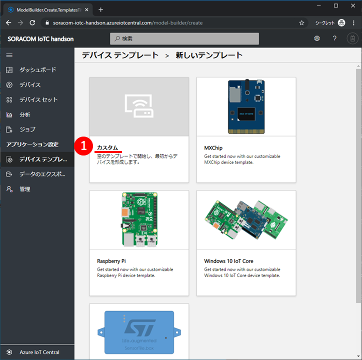
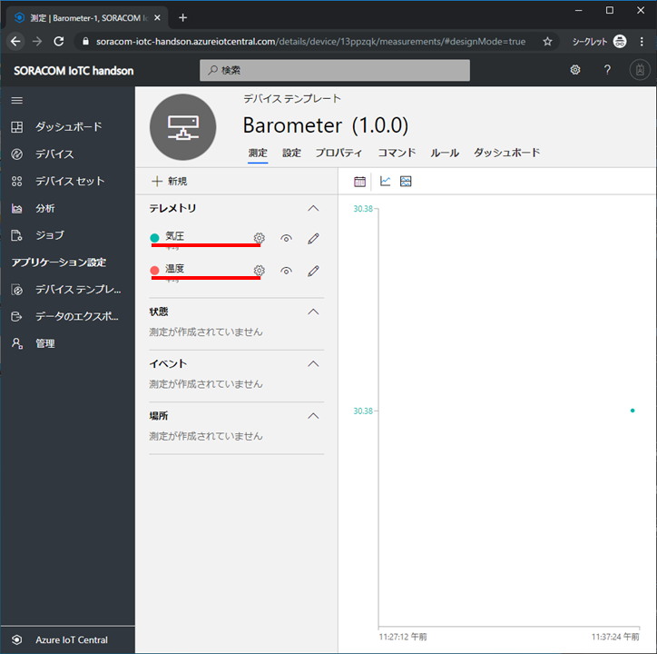
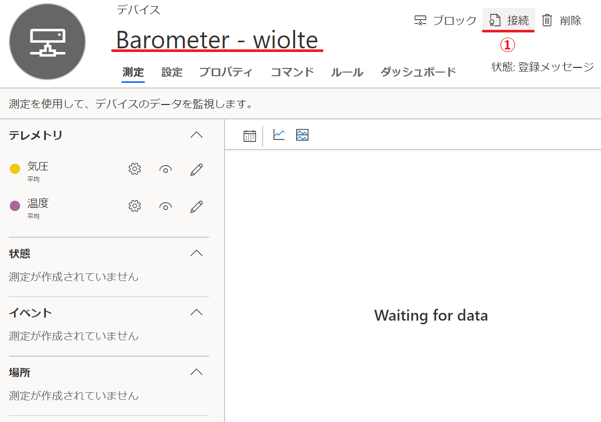

# タッチアンドトライ ~ ReButton ~

## 謝辞

本テキストは、[ReButton+IoT Central体験『 IoT タッチ＆トライ』@de:code2019](https://algyan.connpass.com/event/130744/)のために、IoT ALGYANコミュニティ([Facebook](https://www.facebook.com/groups/ioytjp/), [twitter](https://twitter.com/IOT_ALGYAN?lang=ja), [connpass](https://connpass.com/dashboard/))の有志が協力して制作しています。

スペシャルサンクス！

* [Takashi Matsuoka](https://github.com/matsujirushi)

---

目次

* [タッチアンドトライのゴール](#S-0)
* [2章 ボタンクリックをIoT Centralへ伝える](#1-0) - 15分
  * [2-1 IoTC :  アプリケーションを作成](#1-1)
  * [2-2 IoTC : デバイステンプレートを作成](#1-2)
  * [2-3 IoTC : 測定にメッセージを追加](#1-3)
  * [2-4 IoTC : デバイスを追加](#1-4)
  * [2-5 ReButton : 工場出荷時設定にリセット](#1-5)
  * [2-6 ReButton : 接続情報を設定](#1-6)
  * [2-7 ReButton : ボタンをクリックしてIoT Centralに通知](#1-7)

---

## <a name="S-0">タッチアンドトライのゴール</a>

本テキストは、Azureへ簡単にメッセージ送信できるデバイス**Seeed ReButton**と、デバイスを手軽に管理できるクラウドサービス**Azure IoT Central**を使って、IoTシステム構築するタッチアンドトライです。  
デバイス設定、クラウド設定、クラウドサービス連携の手軽さと、プログラミング可能な柔軟性を体感しましょう。

使用するサービスは、次の通りです。

|品名|ドキュメント|
|:--|:--|
|Azure IoT Central|[公式](https://azure.microsoft.com/ja-jp/services/iot-central/)|

**本章**は、SORACOM Beamを通じて受信したデータをIoT Centralに送信して、Web画面で測定データ（絶対圧）を知ることができるようにします。  
具体的には、IoT Centralにアプリケーションを作成してデバイステンプレートを作成、デバイスを追加した後、SORACOM XXXXとIoT Centralへのデバイス接続情報を設定します。

---

## <a name="1-0">2章 測定データをIoT Centralへ伝える</a>

### <a name="1-1">1-1 IoTC :  アプリケーションを作成</a>

|この節での実施概要|
|:--|
|Azure IoT Centralのアプリケーションを作成します。|

 

Webブラウザで`https://apps.azureiotcentral.com`を開いてください。URLを開く際に、Microsoftアカウントでのサインイン認証が求められます。保有しているMicrosoftアカウントを使って、サインインしてください。  
開くと、Azure IoT Centralのアプリケーションが一覧表示されます。  
左上にある、①`新しいアプリケーション`をクリックして、アプリケーションを作成してください。

 

次に、アプリケーションの作成に必要な情報を設定します。  
下表のとおり設定して、最後に⑧`作成`をクリックしてください。

|項目名|値|備考|
|:--|:--|:--|
|①支払いプラン|従量課金制|評価版を選択すると後の手順で作業が進められません(※)|
|②アプリケーションテンプレート|カスタムアプリケーション||
|③アプリケーション名|==任意==|ALGYANタッチアンドトライ|
|④URL|==ユニークURL==|同じURLが既に存在するとエラーになります|
|⑤ディレクトリ|==任意==||
|⑥Azureサブスクリプション|==任意==||
|⑦リージョン|West US||

※）支払いプランで従量課金制を選択してもこのコンテンツの実施による課金は発生しません。

  

 

しばらくすると、アプリケーションが作成されて、ダッシュボードが表示されます。  
黄色いポップアップが表示されている場合は、①`了解しました`をクリックして、表示を消してください。

 

次の画像のとおり表示されていることを確認してください。

---

### <a name="1-2">1-2 IoTC : デバイステンプレートを作成</a>

|この節での実施概要|
|:--|
|作成したアプリケーションに、XXXXのデバイステンプレートを追加します。|
<b>ここ修正必要</b>
 

左の①`デバイステンプレート`をクリックしてください。デバイステンプレートの一覧が表示されます。  
ここで、右上の②[`+`]マークをクリックして、デバイステンプレートを作成してください。  
この時、「アプリケーションはまだプロビジョニング中」という表示が出た場合には少し待ってから再度試してみてください。

 

デバイステンプレートの種類は①`カスタム`を選択してください。

 

デバイステンプレートの名前に①`ReButton`と入力して、②`作成`をクリックしてください。

 

左の①`デバイスエクスプローラー`をクリックしてください。  
②`ReButton (1.0.0)`という名前のデバイステンプレートが表示されて、`ReButton-1(シミュレート済み)`という名前のデバイスが1つ含まれていることを確認してください。

---

### <a name="1-3">1-3 IoTC : 測定にメッセージを追加</a>
<b>ここ修正必要</b>

|この節での実施概要|
|:--|
|ReButtonのデバイステンプレートに、ReButtonから送られてくる情報を定義します。|

 

①`デバイステンプレート`をクリックして、②`ReButton`デバイステンプレートをクリックしてください。

 

デバイステンプレートの①`測定`タブ画面が表示されます。  
②`新しい測定`をクリックしてください。測定の追加画面が表示されます。

 

測定の種類が3つ表示されているので、その中から①`イベント`をクリックしてください。

 

次に、測定の追加に必要な情報を設定します。  
下表のとおり設定して、最後に④`保存`をクリックしてください。

|項目名|値|備考|
|:--|:--|:--|
|①Display Name|メッセージ||
|②フィールド名|message|必ず、この値にしてください|
|③既定の重要度|情報||

 

次の画像のとおり、イベントに**メッセージ**の測定項目が追加されていることを確認してください。

---

### <a name="1-4">1-4 IoTC : デバイスを追加</a>
<b>ここ修正必要</b>

|この節での実施概要|
|:--|
|ReButtonのデバイステンプレートに、ReButtonデバイスを追加します。|

 

左の①`デバイスエクスプローラー`をクリックしてください。②`ReButton (1.0.0)`デバイステンプレートに含まれているデバイスが一覧表示されます。  
ここで、上にある③[`+`]マークをクリックして、④`実際`を選択してください。

 

①`デバイス名`に==任意== (ex. **ReButton #1**)の名前を入力して、②`作成`をクリックしてください。

 

すると、作成したReButtonデバイスが表示されます。  
右上の①`接続`をクリックして、このデバイスの接続情報を表示してください。

 

ここで表示されている`スコープID`,`デバイスID`,`SAS主キー`は、後でReButtonに設定します。  
**メモ帳などにコピー**しておいてください。

---

### <a name="1-6">1-6 ReButton : 接続情報を設定</a>
<b>ここ修正必要</b>

|この節での実施概要|
|:--|
|ReButtonを**Access Pointモード**で起動して、パソコンからReButtonに接続、WebページでWi-FiアクセスポイントとAzure IoT Centralの接続情報を設定します。   **ここでのReButtonへの接続情報の設定中は、一旦パソコンのインターネット接続が途切れます。**|

 

まず、ReButtonをAccess Pointモードで起動します。
このために、10秒以上ボタンを押し続けてください。  
ボタンを数秒間押し続けてでも、LED(青色)が光らない場合は、一度ボタンを押すのをやめて、ひと呼吸、間を開けてから、もう一度ボタンを押し続けてみてください。(ボタンを強く押す必要はありません。少しだけ押し方や押す場所を変えてみると、うまくいくかもしれません。)  

うまくいった場合は、ボタンを押している間、LEDが青色→黄色→水色→白色と変化します。白色になったら、ボタンを離してください。

すると、ボタンがAccess Pointモードで起動して、LEDが白色の点滅になります。

 

ReButtonがAccess Pointモードで起動したことが確認できたら、次にパソコンからReButtonにWi-Fi接続をします。  
パソコンのWi-Fi接続設定(SSID一覧表示)の中から、「AZB-xxxxxxxx」という名前のアクセスポイントを探してください。  
(「AZB-xxxxxxxx」は、自分が利用するReButtonの側面に貼ってあるSSIDを選択してください。)  
見つけたら、①`接続`をクリックして、Wi-Fi接続します。

 

接続操作すると、ReButtonのWi-Fi APからは、インターネット接続ができないため、接続試行中のままとなります。
このため、接続試行中表示のまま、次の作業に進みます。  
> Windows 10の場合、ここで待ち過ぎると、元のインターネット接続できるWi-Fi APでの接続に、自動的に戻ってしまうことがあります。続く作業で、うまくいかない場合は、このWi-Fi接続先を再確認してください。

次の作業として、ここでは、ReButtonにWi-FiとAzure IoT Centralの接続設定をするので、任意のブラウザで、①`http://192.168.0.1/` にアクセスしてください。  
ブラウザ画面上に、ReButtonの設定項目一覧画面、ReButton - Homeが表示されますので、②`Wi-Fi`のリンクをクリックしてください。

 

ReButtonのWi-Fi接続設定画面が表示されます。  
下表のとおり設定して、最後に③`Save`をクリックしてください。

|項目名|値|
|:--|:--|
|①Wi-Fi SSID|`XXXXXXX`をプルダウン候補から選択(当日別途展開します)|
|②Wi-Fi Passphrase|`zzzzzz`(当日別途展開します)|

 

「Wi-Fi saved.」の表示が出たら、①`Home`をクリックしてください。  

 

次に、Azure IoT Centralの接続設定を行っていきます。
ブラウザ画面上のReButton - Home画面から、①`Azure IoT Central`のリンクをクリックしてください。

 

ReButtonのAzure IoT Central接続設定画面が表示されます。  
事前に**メモ帳などにコピー**しておいた各種情報を下表のとおり設定して、最後に④`Save`をクリックしてください。

|項目名|値|
|:--|:--|
|①Scope ID|== 事前にメモしておいた`スコープID` ==|
|②Devise ID|== 事前にメモしておいた`デバイスID` ==|
|③SAS Key|== 事前にメモしておいた`SAS主キー` ==|

 

最後に、①`Shutdown`をクリックしてください。

 

Shutdownの表示がされたら、設定完了です。確認ができたら、ブラウザを閉じてください。  
この後は、Azure IoT Central側での操作、動作確認になります。  
パソコンのWi-Fi設定をインターネット接続できるアクセスポイントに切り替えてください。

---

### <a name="1-7">1-7 ReButton : ボタンをクリックしてIoT Centralに通知</a>
<b>ここ修正必要</b>

|この節での実施概要|
|:--|
|設定済みのReButtonデバイステンプレート上で、ボタンのクリック通知(**メッセージ**)が届くことを確認します。|

 

Azure IoT Central上で、①`デバイスエクスプローラー`をクリックします。  
その後、テンプレートの②`ReButton (1.0.0)`(自分がつけたデバイステンプレート名)と、続いて③`ReButton #1`(自分がつけたデバイス名)を順にクリックします。

 

自動的にReButtonの測定画面が表示されます。  
もし、異なる画面が表示された場合、①`測定`をクリックします。

 

**さあ、ボタンを押してみましょう！**

ReButtonは、最初のクリックの反応が遅いです。  
これは、ボタンを押したときに回路の電源スイッチがONして動き出そうとしている時間です。  
そのため、最初のプッシュはちょっと長めに押し続ける必要があります。  
LEDが青色に点灯するまで押して、青色になったら離す。  
「強く押す」ではありません！ **「長く押す」** です。

|【注意！】| LED(白)になるまで、ボタンを押し続けた場合は、 最初の設定で行ったAccess Pointモードになってしまいます。 この場合は、一度裏ぶたを開けて、電池を抜き差しして、 Access Pointモードを解除し、元に戻してください。 |
|:--|:--|

ボタンの内部プログラムでは、

1. 押す→LEDが青色に  
2. 離す→LEDは青色のまま  
3. 1秒間放置→シングルクリックと判断  
4. クラウドへ通知しようとし、LEDが点滅します。  

> **最後に赤色に点滅**したときは、クラウドへの通知に失敗しています。  
> 何度試しても症状が変わらないときは、IoT Centralの設定、Wi-Fi パスワードの設定などを再度ReButtonに設定してください。

また、3.の1秒間放置のときに押すと、ダブルクリック、トリプルクリックと変化して、LED表示が変わります。

|クリック種類|LED色|
|:--|:--|
|シングルクリック|青|
|ダブルクリック|緑|
|トリプルクリック|紫|

もしくは、ボタンをずっと押し続けていると、下記のように変化します。

|クリック種類|LED色|備考|
|:--|:--|:--|
|ロングプレス|黄||
|スーパーロングプレス|水色||
|ウルトラロングプレス|白|Access Pointモード|

いろいろな押し方で何度か押してみましょう。

 

ブラウザでAzure IoT Central上のデバイス**ReButton #1**にイベント通知が届いたか、確認するために、ブラウザの表示を最新に更新します。  
クラウドへのメッセージが届いて、デバイスエクスプローラーの測定画面で確認できるまでには、少し時間がかかります。  
しばらく、根気よく表示の更新を続けてみてください。  
正常にメッセージが届いていると、`♦`マークの表示が出て、確認できます。  
さらに、この`♦`マークにマウスカーソルを合わせ、クリックするとメッセージの詳細が確認できます。

---
