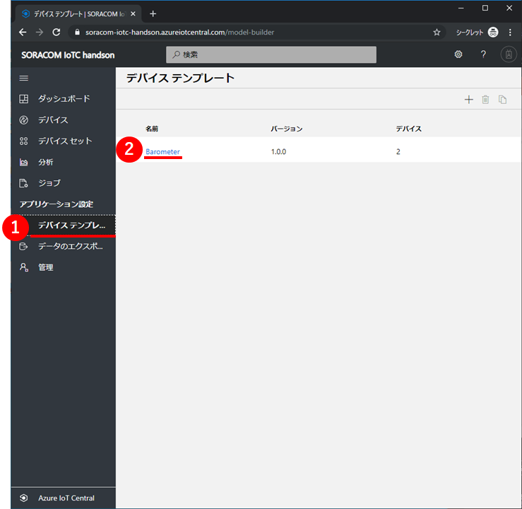
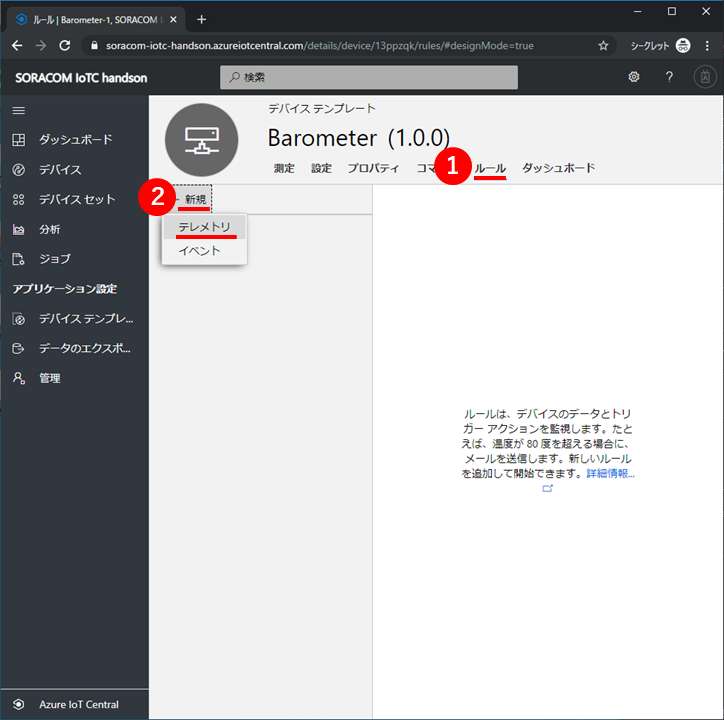
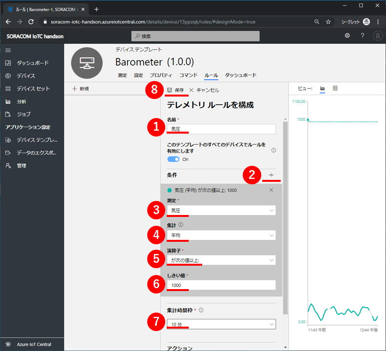
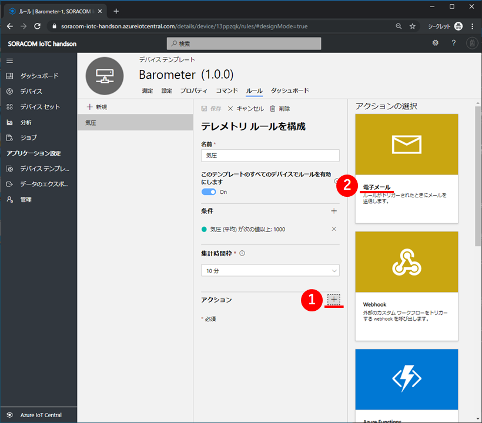
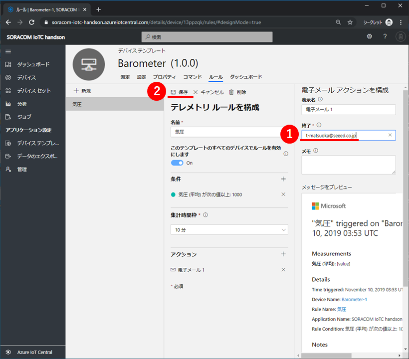

# 3-1.気圧上昇でEメール通知

## <a name="3-1-1">1. IoTC : ルールを追加</a>

Azure IoT Central上で、左の①`デバイステンプレート`をクリックして、②`ReButton`デバイステンプレートをクリックしてください。

デバイステンプレートの測定タブ画面から、①`ルール`をクリックして、ルールタブ画面を表示します。  
続いて、②`新規` > `テレメトリ`をクリックしてください。

テレメトリルールを構成する画面が表示されます。
ここで、下表のとおり設定して、最後に⑧`保存`をクリックしてください。

|項目名|値|備考|
|:--|:--|:--|
|①名前|==任意==|気圧|
|③測定|気圧|②[`+`]をクリックして、`条件`を展開した上で、選択します|
|④集計|平均|②[`+`]をクリックして、`条件`を展開した上で、選択します|
|⑤演算子|が次の値以上:|②[`+`]をクリックして、`条件`を展開した上で、選択します|
|⑥しきい値|==任意==|②[`+`]をクリックして、`条件`を展開した上で、選択します|
|⑦集計時間枠|==任意==|10分|

次に、アクションの右の①[`+`]をクリックし、右に表示されるアクションの選択の中から②`電子メール`をクリックします。  

最後に、終了にMicrosoftアカウントのEメールアドレスを入力して、②`保存`をクリックしてください。  
（他のEメールアドレスを入力可能ですが、IoT Centralに認識されていないため、Eメールが送信されません。）

## <a name="3-1-2">2. データの確認</a>

気圧センサーを上げたり下げたりして測定値を変化させて、Eメールが届くことを確認してください。

ルールの条件が合致してから、Eメールが届くまで10分ほどかかるときがありますので、気長に待ちましょう。

以上で本章は終了です。

* [目次ページへ戻る](../index.md)
