# タッチアンドトライ ~ ReButton ~

## 謝辞

本テキストは、[ReButton+IoT Central体験『 IoT タッチ＆トライ』@de:code2019](https://algyan.connpass.com/event/130744/)のために、IoT ALGYANコミュニティ([Facebook](https://www.facebook.com/groups/ioytjp/), [twitter](https://twitter.com/IOT_ALGYAN?lang=ja), [connpass](https://connpass.com/dashboard/))の有志が協力して制作しています。

スペシャルサンクス！

* [Takashi Matsuoka](https://github.com/matsujirushi)

---

目次

* [タッチアンドトライのゴール](#S-0)
* [3-1章 測定項目を増やす](#2-0) - 15分
  * [3-1-1 IoTC : 測定項目にクリック種類を追加](#2-1)
  * [3-1-2 IoTC : 測定項目にバッテリー電圧を追加](#2-2)
  * [3-1-3 ReButton : ボタンをクリックしてIoT Centralに通知](#2-3)
* [3-2章 ボタンクリックをSMS通知する](#3-0) - 20分
  * [3-2-1 Azure : アクショングループを作成](#3-1)
  * [3-2-2 IoTC : ルールを追加](#3-2)
  * [3-2-3 ReButton : ボタンをクリックしてSMS通知](#3-3)
* [3-3章 ボタンクリックからコード呼び出し](#4-0) - 15分
  * [3-3-1 Azure : Function Appを作成](#4-1)
  * [3-3-2 VSCode : ローカルにコードを作成](#4-2)
  * [3-3-3 VSCode : ローカルのコードをFunction Appに配置](#4-3)
  * [3-3-4 IoTC : ルールを追加](#4-4)
  * [3-3-5 VSCode : コードのログをモニタリング](#4-5)

---


使用するデバイスとサービスは、次の通りです。

|品名|ドキュメント|
|:--|:--|
|Azure IoT Central|[公式](https://azure.microsoft.com/ja-jp/services/iot-central/)|
|Azure Monitor|[公式](https://azure.microsoft.com/ja-jp/services/monitor/)|
|Azure Functions|[公式](https://azure.microsoft.com/ja-jp/services/functions/)|


**3-1章**は、IoT CentralのWeb画面で表示する項目を増やします。  
IoT Centralのデバイステンプレートに、測定項目を追加する簡単な操作だけで、Web画面の表示項目が増えるのを体験します。

**3-2章**は、ReButtonのボタンクリック操作をIoT Centralを経由してAzure Monitorに通知し、スマートフォンへSMS通知します。  
IoT Centralのルールという機能を使って、Azure Monitorに通知します。Azure Monitorにはさまざまなオペレーターへの通知方法がありますが、SMS通知を使います。

**3-3章**は、ReButtonのボタンクリック操作をIoT Centralを経由してAzure Functionsに通知します。  
Azure Functionsへ通知することで、その後の動作をプログラミングによって変更できることを学びます。

---

## <a name="2-0">3-1章 測定項目を増やす</a>

### <a name="2-1">3-1-1 IoTC : 測定項目にクリック種類を追加</a>
<b><font color=RED>ここ修正必要</font></b>

|この節での実施概要|
|:--|
|最後のクリック種類ごとの状態値を測定できるようにします。|

<br/>

①`デバイステンプレート`をクリックして、②`ReButton`デバイステンプレートをクリックしてください。

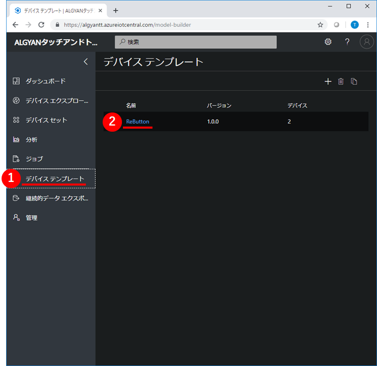

<br/>

最初に測定項目を作った時と同じように、デバイステンプレートの①`測定`タブ画面が表示されます。  
②`新しい測定`をクリックしてください。測定の追加画面が表示されます。

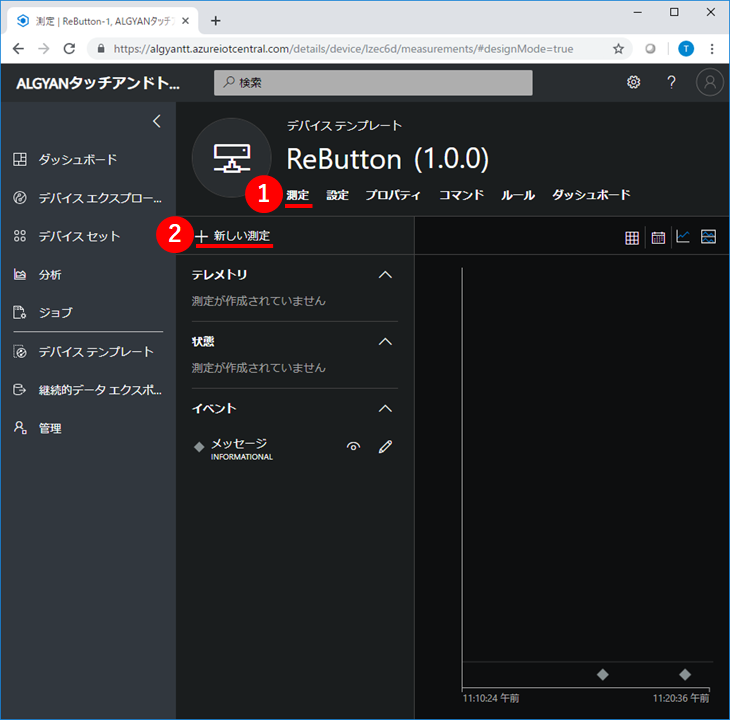

<br/>

測定の種類が3つ表示されているので、その中から①`状態`をクリックしてください。

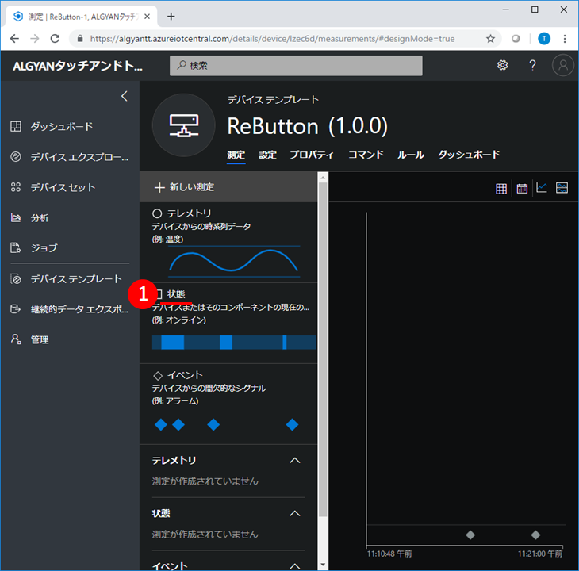

<br/>

次に、測定の追加に必要な情報を設定します。  
まず、下表に示す①，②を設定します。

|項目名|値|備考|
|:--|:--|:--|
|①Display Name|クリック種類||
|②フィールド名|actionNum|必ず、この値にしてください|

続いて、③[`+`]をクリックして、状態(クリック種類)ごとの④`値`、⑤`表示名`、⑥`カラー`を下表のように**設定を繰り返し**ながら、状態(クリック種類)を追加していきます。  
> **④`値`は、必ず下表の値を設定してください。**

|状態(クリック種類)|④値|⑤表示名|⑥カラー|参考設定色|RGB値|
|:--|:--|:--|:--|:--|:--|
|シングルクリック|**1**|Single Click|==任意の色==|薄水色|rgb(138, 212, 235)|
|ダブルクリック|**2**|Double Click|==任意の色==|薄緑|rgb(1, 184, 170)|
|トリプルクリック|**3**|Triple Click|==任意の色==|マゼンタ|rgb(211, 19, 211)|
|ロングプレス|**10**|Long Press|==任意の色==|ダークイエロー|rgb(242, 200, 15)|
|スーパーロングプレス|**11**|Super Long Press|==任意の色==|水色|rgb(115, 248, 255)|

> ⑥`カラー`の設定は、初期設定値のままでもかまいませんが、色を指定したいときは、下線の部分をクリックして表示される色選択のパレットから選んでください。
> なお、パレットの各色のRGB値は、マウスカーソルを当てるとpopup表示されます。

> カラーパレットはIoT Centralのテーマによって変わるので、上表の参考設定色に設定できない場合があります。
> (上表の参考設定色やRGB値は、テーマが「ダーク」の場合になります。)  

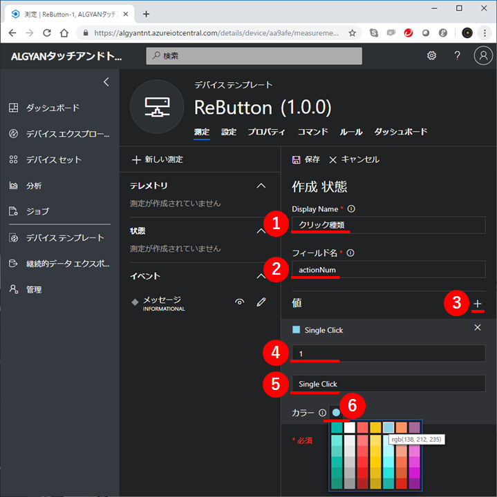

<br/>

全ての状態(クリック種類)の設定が完了したら、①`保存`をクリックしてください。

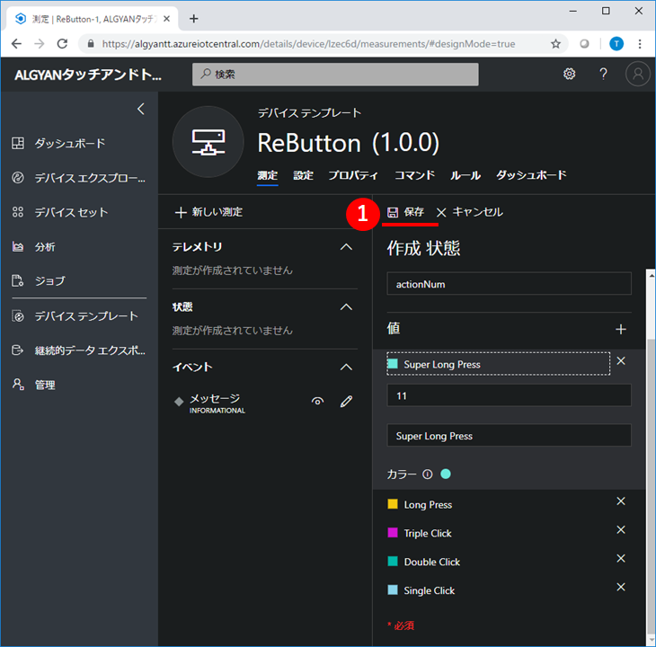

---

### <a name="2-2">3-1-2 IoTC : 測定項目にバッテリー電圧を追加</a>
<b><font color=RED>ここ修正必要</font></b>

|この節での実施概要|
|:--|
|ReButtonのバッテリー電圧を測定できるようにします。|

<br/>

前と同じように、①`新しい測定`をクリックしてください。測定の追加画面が表示されます。

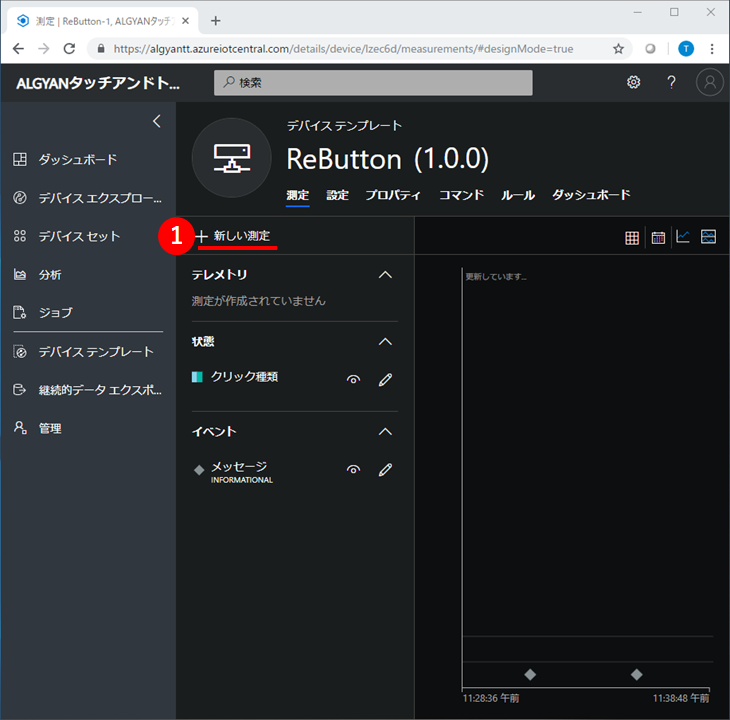

<br/>

測定の種類が3つ表示されているので、今度は①`テレメトリ`をクリックしてください。

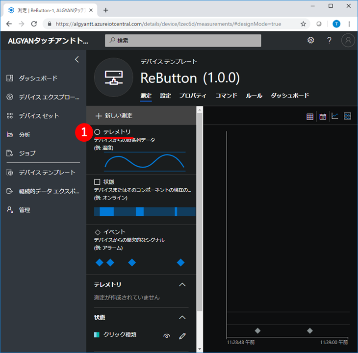

<br/>

次に、測定の追加に必要な情報を設定します。  
下表のとおり設定して、最後に⑦`保存`をクリックしてください。

|項目名|値|備考|
|:--|:--|:--|
|①Display Name|バッテリー電圧||
|②フィールド名|batteryVoltage|必ず、この値にしてください|
|③単位|V||
|④最小値|0||
|⑤最大値|4||
|⑥小数点以下桁数|1||
|カラー|==任意の色==|初期値のままでOK|

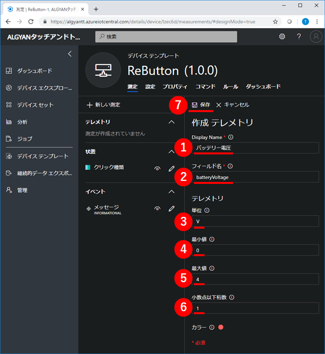

<br/>

次の画像のとおり、テレメトリと状態のそれぞれに**バッテリー電圧**と**クリック種類**の測定項目が追加されていることを確認してください。

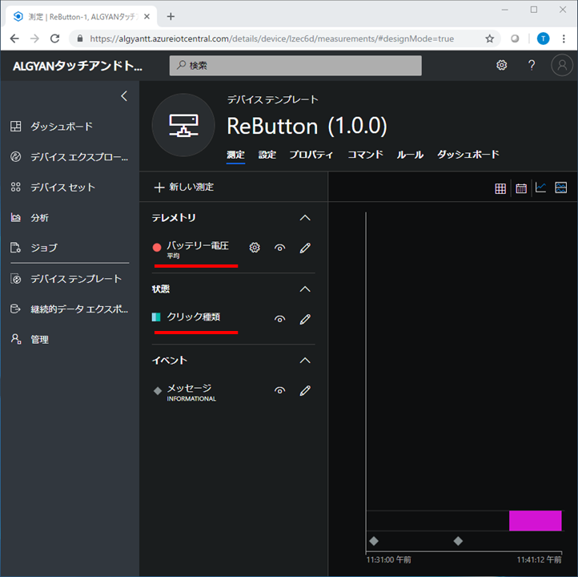

---

### <a name="2-3">3-1-3 ReButton : ボタンをクリックしてIoT Centralに通知</a>
<b><font color=RED>ここ修正必要</font></b>

|この節での実施概要|
|:--|
|設定済みのReButtonデバイステンプレート上で、ボタンのクリック通知(**テレメトリ**、**状態**、**メッセージ**)が届くことを確認します。|

<br/>

Azure IoT Central上で、①`デバイスエクスプローラー`をクリックします。  
その後、テンプレートの②`ReButton (1.0.0)`(自分がつけたデバイステンプレート名)と、続いて③`ReButton #1`(自分がつけたデバイス名)を順にクリックします。

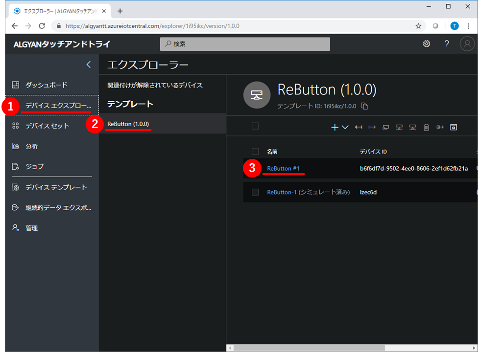

<br/>

自動的にReButtonの測定画面が表示されます。  
もし、異なる画面が表示された場合、①`測定`をクリックします。

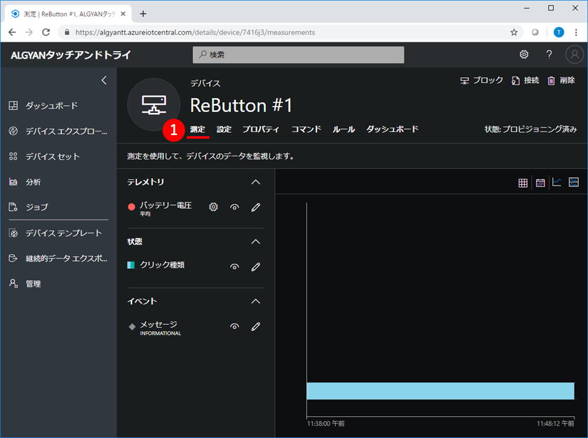

<br/>

**さあ、ボタンを押してみましょう！**

イベント通知の確認のときと同じように、ボタンを押します。

|【注意！】| LED(白)になるまで、ボタンを押し続けた場合は、<br>最初の設定で行ったAccess Pointモードになってしまいます。<br>この場合は、一度裏ぶたを開けて、電池を抜き差しして、<br>Access Pointモードを解除し、元に戻してください。|
|:--|:--|

|クリック種類|LED色|
|:--|:--|
|シングルクリック|青|
|ダブルクリック|緑|
|トリプルクリック|紫|

もしくは、ボタンをずっと押し続けていると、下記のように変化します。

|クリック種類|LED色|備考|
|:--|:--|:--|
|ロングプレス|黄||
|スーパーロングプレス|水色||
|ウルトラロングプレス|白|Access Pointモード|

いろいろな押し方で何度か押してみましょう。


<br/>

ブラウザでAzure IoT Central上のデバイス**ReButton #1**にイベント通知が届いたか、確認するために、ブラウザの表示を最新に更新します。  
クラウドへのメッセージが届いて、デバイスエクスプローラーの測定画面で確認できるまでには、少し時間がかかります。  
しばらく、根気よく表示の更新を続けてみてください。  
正常にメッセージが届いていると、**バッテリー電圧**のグラフ(ポイント)、**状態**の帯表示、♦マークの表示が出て、確認できます。  

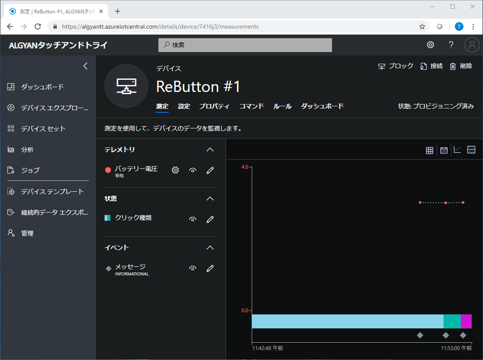

---

## <a name="3-0">3-2章 ボタンクリックをSMS通知する</a>
<b><font color=RED>ここ修正必要</font></b>

### <a name="3-1">3-2-1 Azure : アクショングループを作成</a>

|この節での実施概要|
|:--|
|Azureポータルにサインインして、Azureモニターサービスで、SMSメッセージ通知を行うためのアクショングループを作成します。|

<br/>

Webブラウザで`https://portal.azure.com`を開いてください。URLを開く際に、Microsoftアカウントでのサインイン認証が求められます。  
**Azure IoT Centralにサインインした時と同じMicrosoftアカウント**を使って、サインインしてください。  
サインインできたら、①`リソース、サービス、ドキュメントの検索`入力にて、「`モニター`」と、キーワード入力し（エンターキーを押す必要はありません）、出てきたサービスの②`モニター`をクリックしてください。

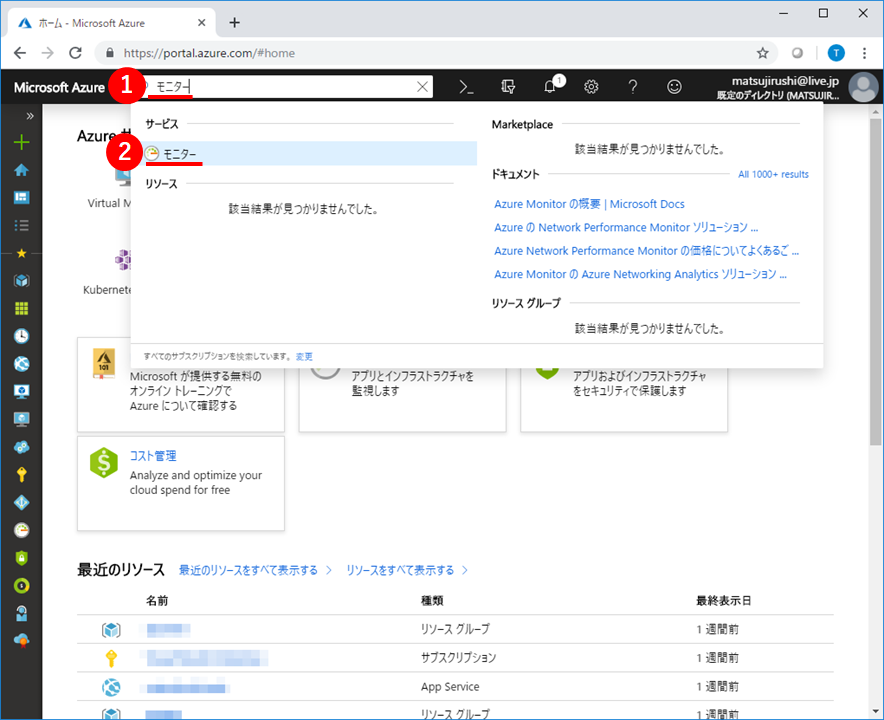

<br/>

`モニター`サービスの画面が開いたら、①`アラート`をクリックし、続いて②`アクションの管理(Manage actions)`をクリックしてください。

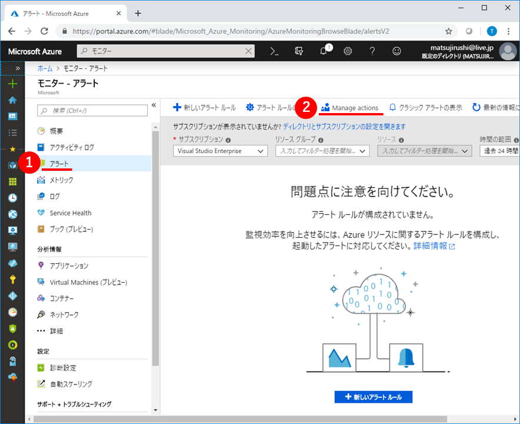

<br/>

次に、アクションの管理(Manage actions)画面で、①`＋アクショングループの追加`をクリックします。

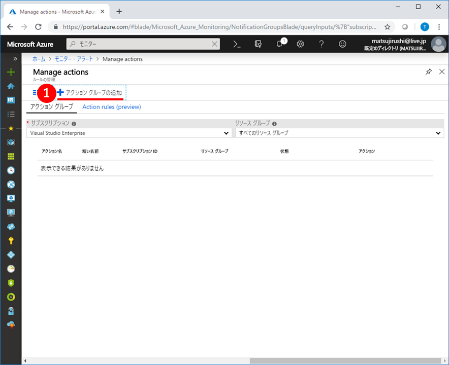

<br/>

アクショングループの追加画面で、下表のとおり①～⑥までを設定していきます。

|項目名|値|備考|
|:--|:--|:--|
|①`アクショングループ名`|==任意==|ReButton|
|②`短い名前`|ReButton|必ずこの名前にしてください|
|③`サブスクリプション`|==任意==||
|④`リソースグループ`|==任意==|初期表示の`Default-ActivityLogAlerts(作成予定)`のままでOKです|
|⑤`アクション名`|==任意==||
|⑥`アクションタイプ`|`電子メール/SMS/プッシュ/音声`|必ずこれを選択してください|

⑥までの設定ができましたら、⑥の右側の`詳細の編集`をクリックしてください。

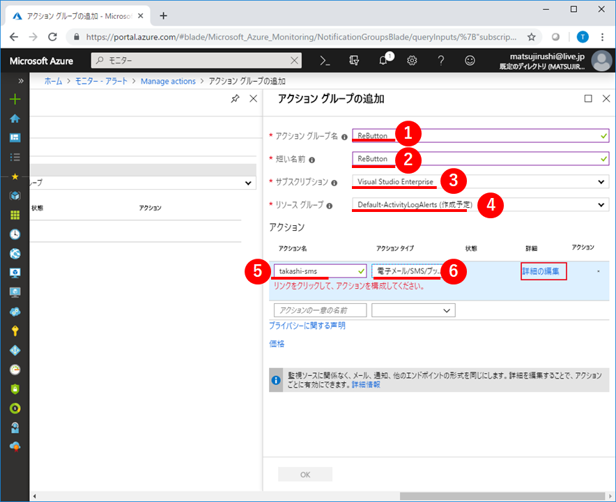

<br/>

電子メール/SMS/プッシュ/音声の詳細設定画面で、SMS用の設定を行います。  
まず、①`SMS`にチェックを入れ、国コードで②`81`を選択します。  
続いて、電話番号に、お手持ちのスマートフォン(SMS受信できるデバイスならスマートフォン以外でもOK)の電話番号(先頭'0'なし)を入力してください。

```
ex) 電話番号が「090-xxxx-abcd」の場合、「90-xxxx-abcd」と入力
```

これらの設定が完了したら、最後に④`OK`をクリックし、その後⑤`OK`をクリックします。

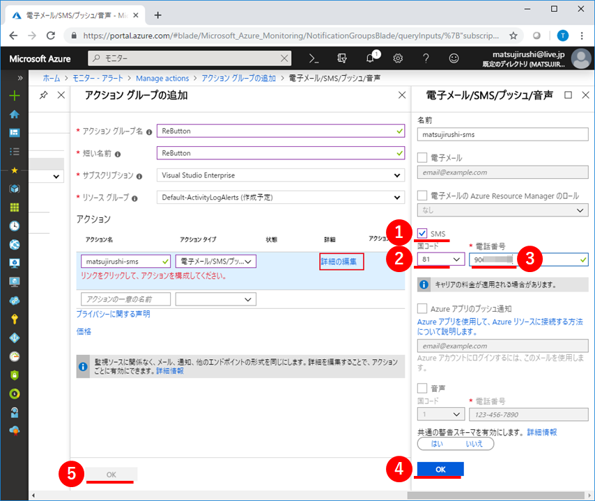

<br/>

アクショングループの追加が完了すると、以下のようになります。  
また、SMSで下記のような通知が届きます。

```
All done. You're in ReButton
group. Reply 'STOP' to stop all.
'Disable ReButton' to stop grp.
'HELP' for info. Msg&data rates
apply
```

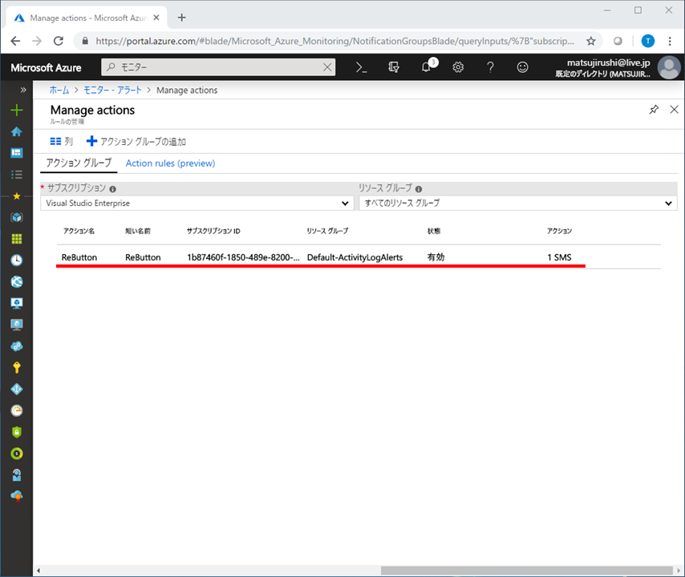

---

### <a name="3-2">3-2-2 IoTC : ルールを追加</a>
<b><font color=RED>ここ修正必要</font></b>

|この節での実施概要|
|:--|
|Azure IoT Centralに戻って、作成したAzureモニターサービスに接続するためのルールを追加します。|

<br/>

Azure IoT Central上で、①`デバイスエクスプローラー`をクリックします。  
その後、テンプレートの②`ReButton (1.0.0)`(自分がつけたデバイステンプレート名)の中にできている③`ReButton-1(シミュレート済み)`にチェックを入れ、これは不要なので、④`ゴミ箱アイコン(削除)`を順にクリックします。

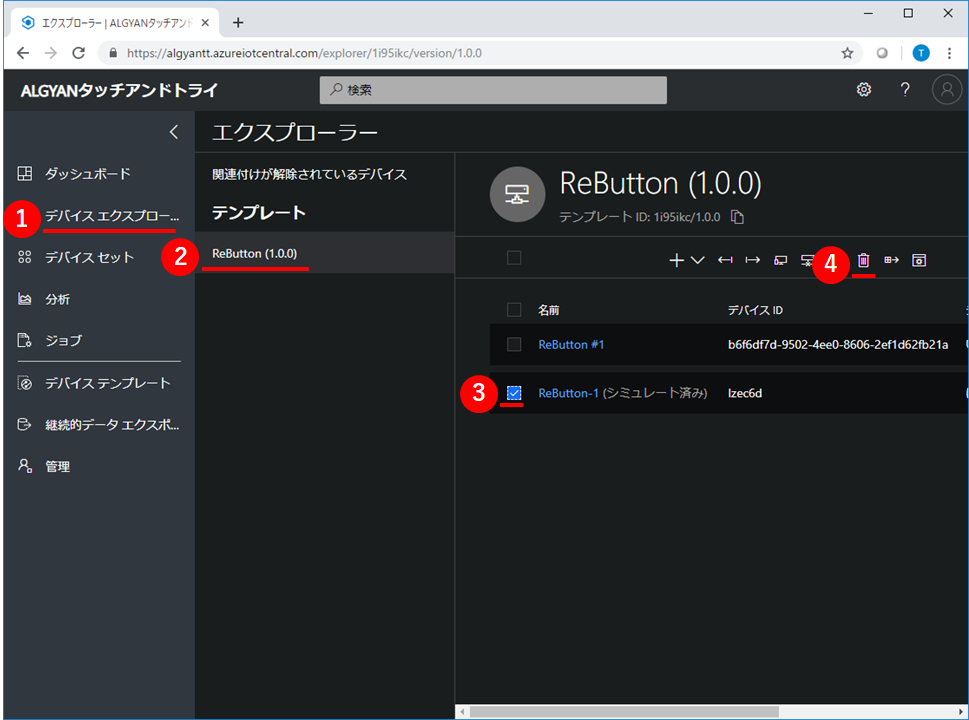

<br/>

左の①`デバイステンプレート`をクリックして、②`ReButton`デバイステンプレートをクリックしてください。

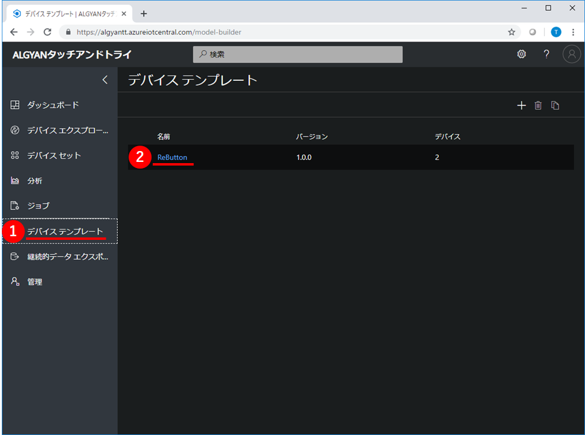

<br/>

デバイステンプレートの測定タブ画面から、①`ルール`をクリックして、ルールタブ画面を表示します。  
続いて、②`新しい規則`をクリックし、さらに③`イベント`をクリックしてください。

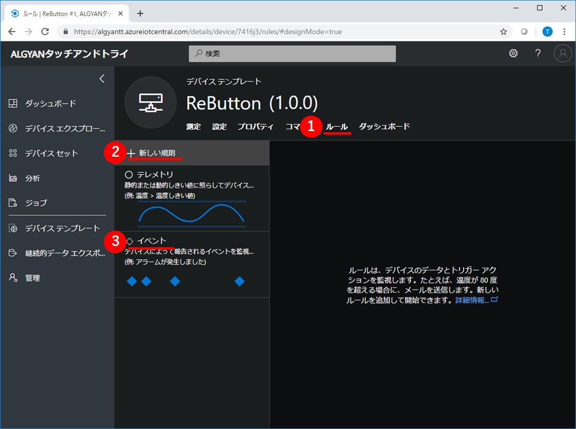

<br/>

イベントルールを構成する画面が表示されます。
ここで、下表のとおり設定して、最後に④`保存`をクリックしてください。

|項目名|値|備考|
|:--|:--|:--|
|①名前|==任意==|notify|
|③測定|メッセージ|②[`+`]をクリックして、`条件`を展開した上で、選択します|

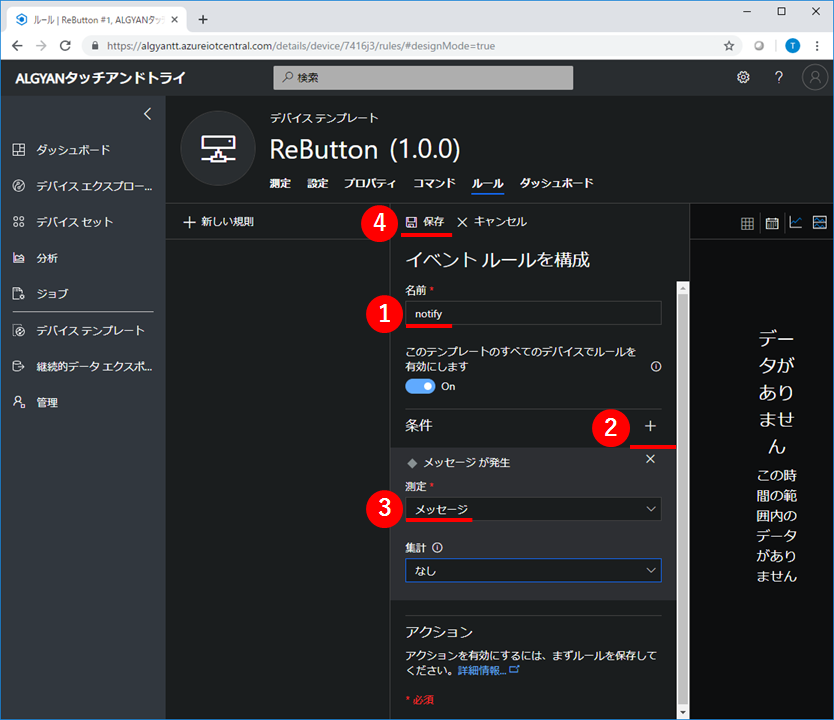

<br/>

次に、アクションの右の①[`+`]をクリックし、右に表示されるアクションの選択の中から②`Azure Monitor アクション グループ`をクリックします。

```
「②Azure Monitor アクション グループ」は、アクションの選択肢の最後の方にあります。
　上下スクロールさせて、表示させたうえで、クリックしてください。
```

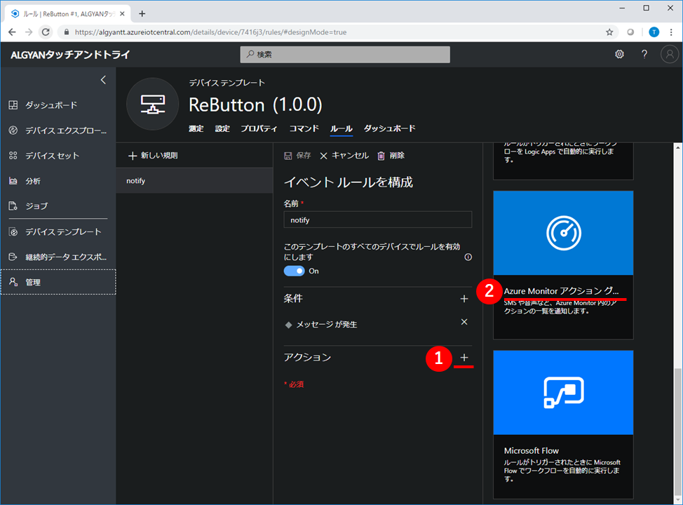

<br/>

最後に、アクショングループで、先にAzureモニターサービスで作成した①`ReButton`を選択し、②`保存`をクリックして、ルールの追加が終了です。

> アクショングループのリストが表示されるまで時間が掛かることがあります。  
> 何も表示されない場合は少し待ってから再度確認してください。

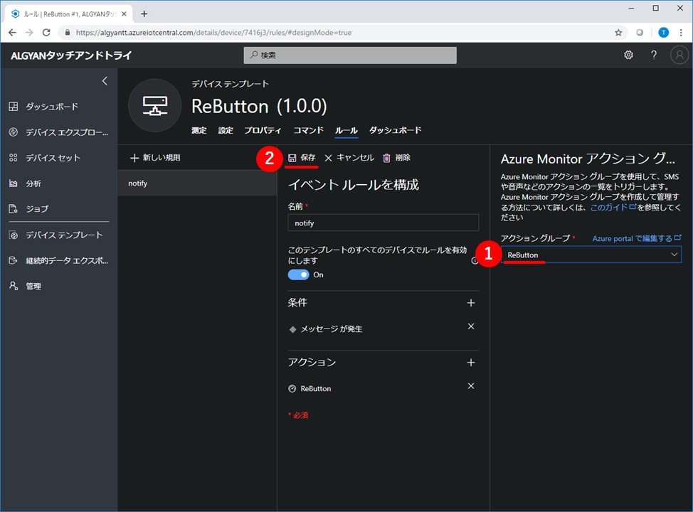

---

### <a name="3-3">3-2-3 ReButton : ボタンをクリックしてSMS通知</a>
<b><font color=RED>ここ修正必要</font></b>

|この節での実施概要|
|:--|
|Azureモニターサービスに登録したスマートフォンに、ボタンのクリック通知(**メッセージ**)による**SMSメッセージ**が届くことを確認します。|

<br/>

**さあ、ボタンを押してみましょう！**

イベント通知の確認のときと同じように、ボタンを押します。

|【注意！】| LED(白)になるまで、ボタンを押し続けた場合は、<br>最初の設定で行ったAccess Pointモードになってしまいます。<br>この場合は、一度裏ぶたを開けて、電池を抜き差しして、<br>Access Pointモードを解除し、元に戻してください。|
|:--|:--|

Azure IoT Centralのデバイステンプレートの測定画面でのメッセージ通知の表示と共に、スマートフォンにもメッセージが届きます。  
このとき、デバイステンプレートの測定画面に表示されるタイミングとスマートフォンにメッセージが届くタイミングは、異なります。  
またスマートフォンに届くメッセージは、ReButtonのボタンの押し方が違っても、区別されません。

**このSMS通知は10分以上、時間がかかるときがあります。**

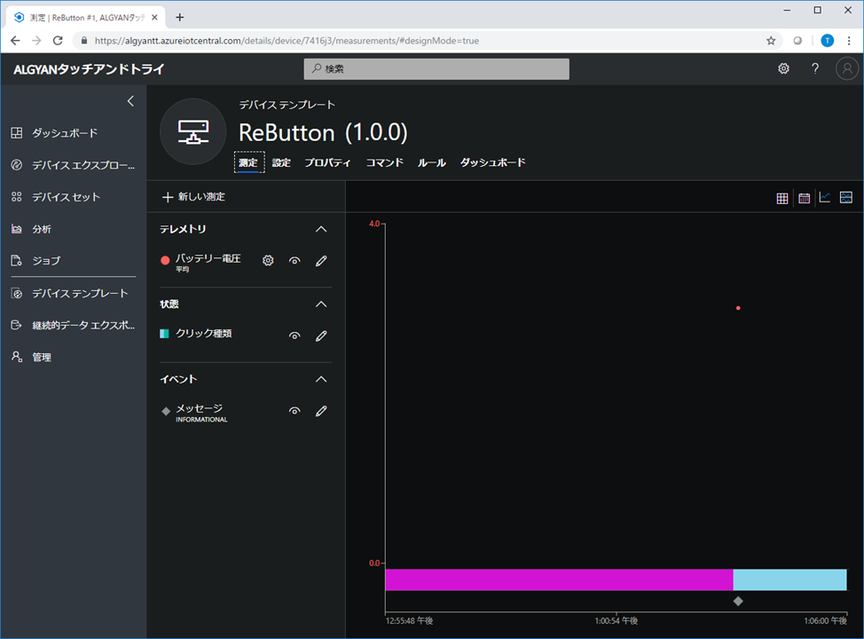

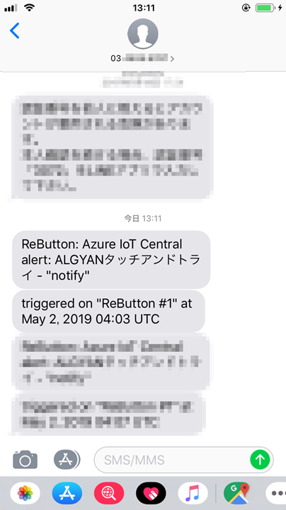

---

## <a name="4-0">3-3章 ボタンクリックからコード呼び出し</a>
<b><font color=RED>ここ修正必要</font></b>

### <a name="4-1">3-3-1 Azure : Function Appを作成</a>
<b><font color=RED>ここ修正必要</font></b>

|この節での実施概要|
|:--|
|Azureポータルにサインインして、Azure Function Appサービスを作成します。|

<br/>

Webブラウザで`https://portal.azure.com`を開いてください。URLを開く際に、Microsoftアカウントでのサインイン認証が求められます。  
**Azure IoT Centralにサインインした時と同じMicrosoftアカウント**を使って、サインインしてください。  
サインインできたら、①[`+`]をクリックして、②`Marketplaceを検索`に「`function app`」とキーワード入力して、出てきた③`Function App`をクリックしてください。

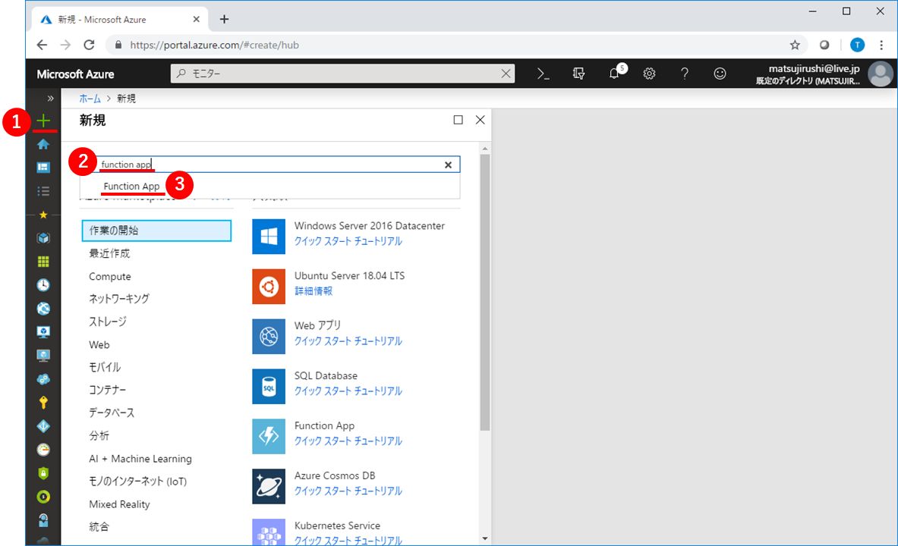

<br/>

次にFunction App画面で、①`作成`をクリックします。

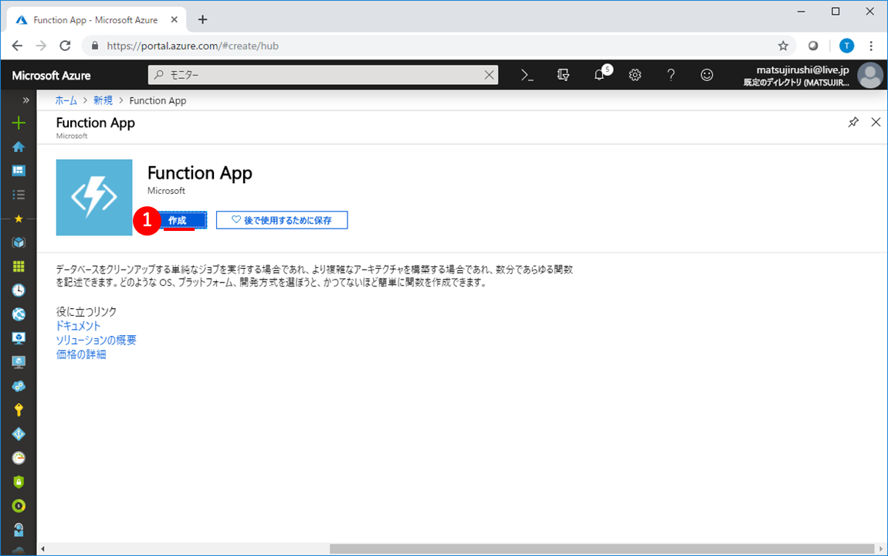

<br/>

続いて、下表のとおり①～④までを設定していきます。

|項目名|値|備考|
|:--|:--|:--|
|①`アプリ名`|==任意==|他に存在しないユニークな名前にしてください|
|②`サブスクリプション`|==任意==||
|③`リソースグループ`|==任意==|`新規作成`を選択し、自動で出る`アプリ名`と同一でOKです|
|④`場所`|米国西部|必ずこれを選択してください|

④までの設定ができましたら、⑤の`作成`をクリックしてください。  
これで、Azure Function Appの作成が完了です。

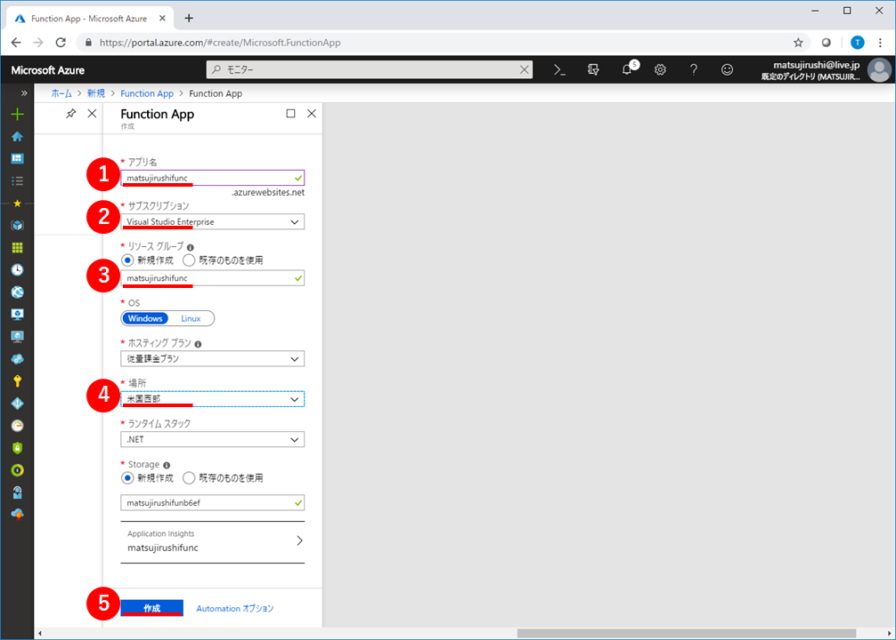

---

### <a name="4-2">3-3-2 VSCode : ローカルにコードを作成</a>
<b><font color=RED>ここ修正必要</font></b>

|この節での実施概要|
|:--|
|Visual Studio Code(VS Code)を使って、Azure Function AppサービスのWebトリガーを受けるコードを作成します。|

<br/>

VS Codeを起動し、左端中央の①`Azureマーク`をクリックします。  
続いて、②`フォルダアイコン(Create New Project...)`をクリックします。  
ここで表示されるフォルダ選択ダイアログで、新規プロジェクト用に適当なフォルダを準備し、選択します。

**【注意】①`Azureマーク`は、Azure Functions の拡張機能**がインストールされていないと、表示されません。  
①`Azureマーク`の表示がない場合は、VS Code上からAzure Functions の拡張機能をインストールしてください。

> VS Codeのメニューなど画面表示(表示有無、配置)は、それぞれのパソコンにおける拡張機能(Extensions)のインストール状況で、異なります。  
> 適宜、読み替えてください。

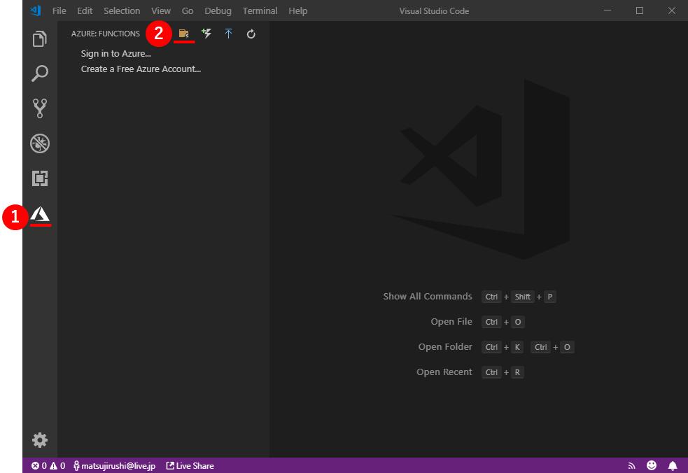

<br/>

続いて、新規プロジェクトの各項目を下表のとおり①～⑦まで設定していきます。

|項目名|値|備考|
|:--|:--|:--|
|①`Select a language for your function project`|C#||
|②`Select a runtime`|Azure Function v2(.NET Standard)|macOSを使っている場合は表示されません|
|③`Select a template for your project's first function`|HttpTrigger||
|④`Provide a function name`|==任意==|HttpTriggerReButton|
|⑤`Provide a namespace`|==任意==|Company.Function|
|⑥`AccessRights`|Anonymous||
|⑦`Select how you would like to open your project`|Open in current window||

最後の⑦の設定を選択すると、プロジェクトの作成が始まります。  

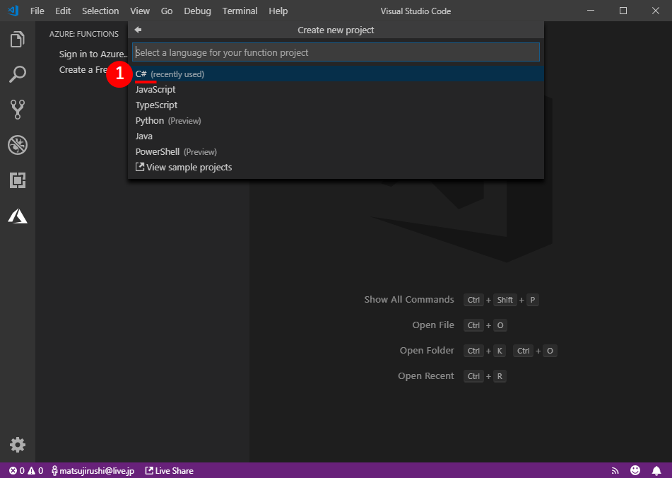

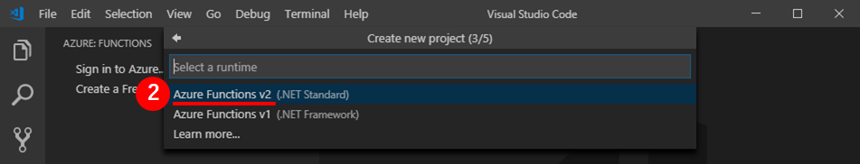

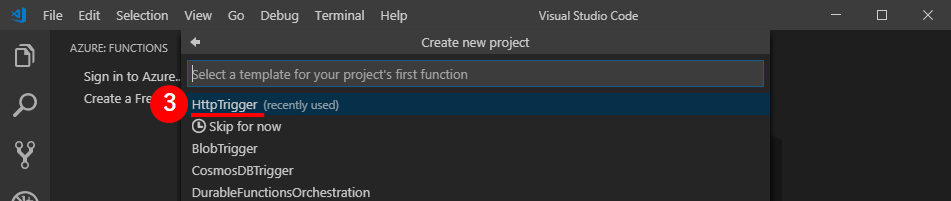

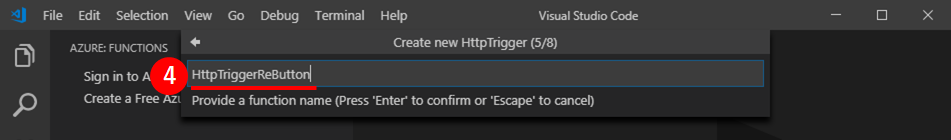

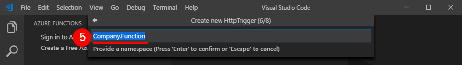

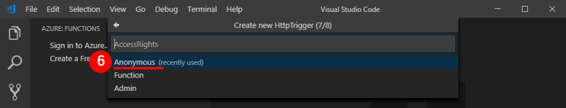

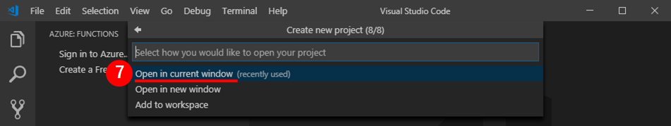

<br/>

プロジェクトの作成が完了すると、C#のプログラムコード(ひな形)がエディタで開かれます。  
ここでも、VS Codeの拡張機能(Extensions)のインストール状況によって、クラスライブラリの依存関係を解決するためのメッセージ(There are unresolved dependencies. Please execute the restore command to continue.)が出る場合があります。  
この場合は、①`Restore`をクリックすることで、解決できます。  
> その他、各種の拡張機能（Extensions)インストールを推奨するメッセージが出たりします。  
> 適宜、メッセージを確認し、処置してください。

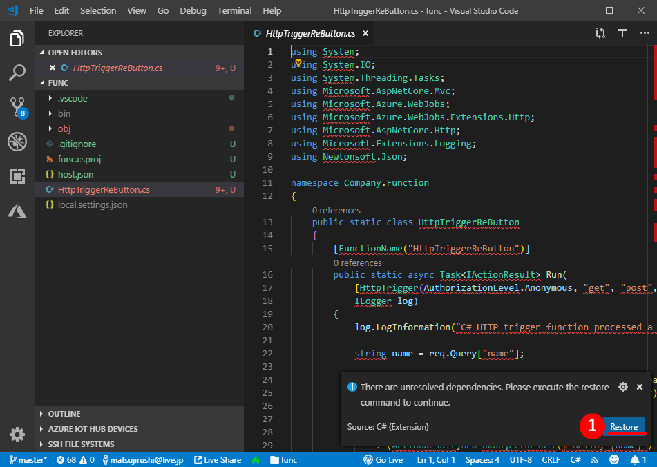

<br/>

最後に、①`View`メニューの中の②`Output`(Ctrl+Shift+U)をクリックして、Outputビューを表示させます。

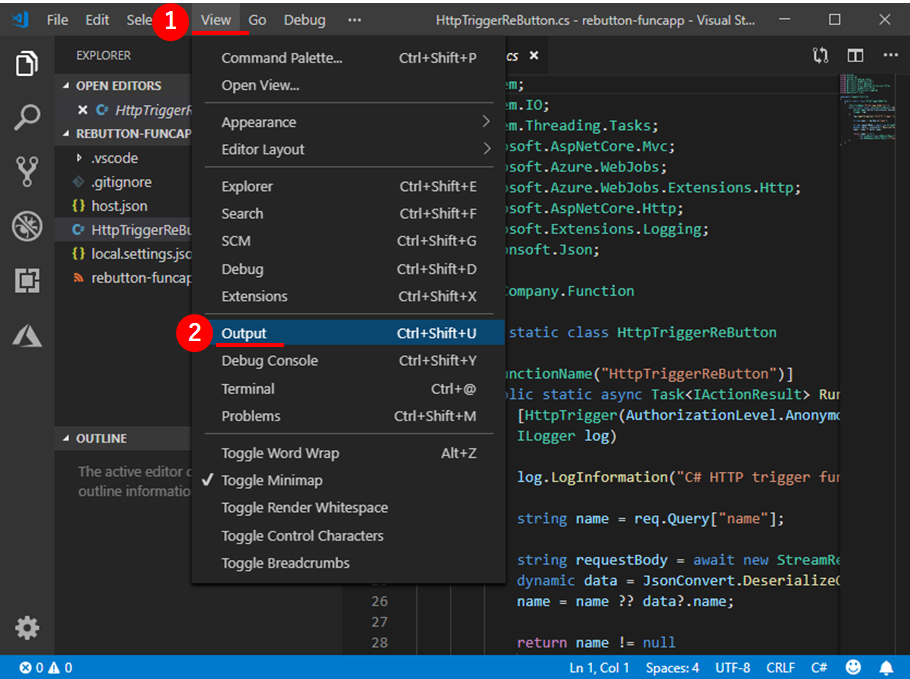

---

### <a name="4-3">3-3-3 VSCode : ローカルのコードをFunction Appに配置</a>
<b><font color=RED>ここ修正必要</font></b>

|この節での実施概要|
|:--|
|VS Codeで作成したローカルのプロジェクトコードを、Azure Function Appサービスに配置(デプロイ)します。|

<br/>

①`Sign in to Azure`をクリックして、自分のMicrosoftアカウントを使ってサインインします。  

既に、VS Codeを使ってAzureサービスにサインインしたことがある場合は、VS Code起動時に自動的にサインインが行われてしまっていて、①`Sign in to Azure`が表示されないことがあります。
その場合は、そのまま次のステップに進みます。

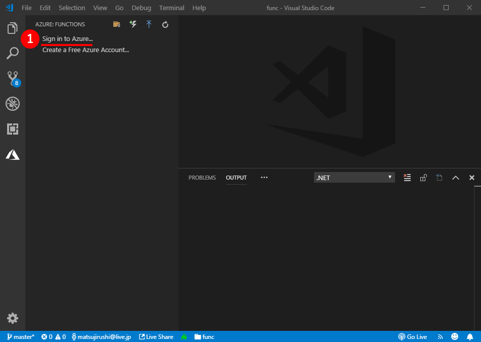

<br/>

②`Select Subscriptions...`をクリックして、有効な自分のAzureサブスクリプション(③`Visual Studio Enterprise`など)を選択し、最後に④`OK`をクリックします。  
正常に自分のAzureサービスに接続(サインイン)できると、作成済みのAzure Function Appのアプリ名一覧が表示されます。

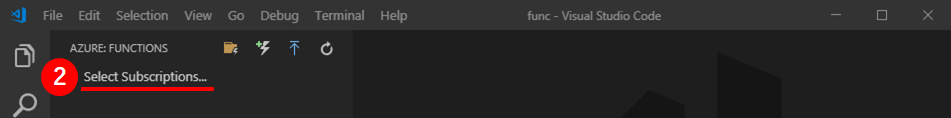

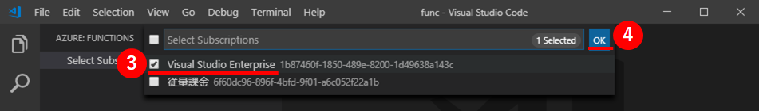

<br/>

次に、①[`↑`](Deploy to Function App...)をクリックします。

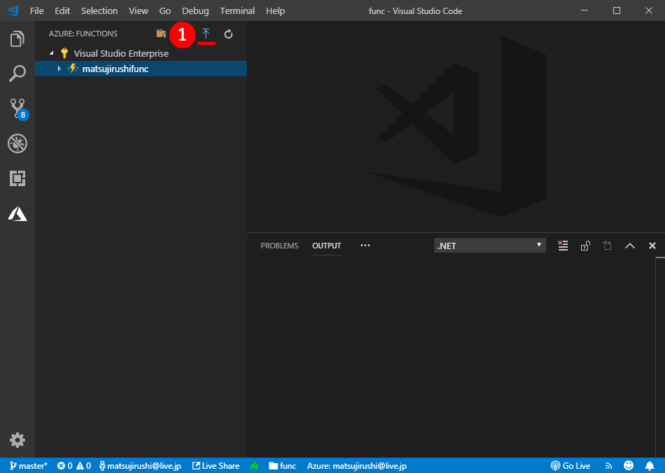

<br/>

続いて、先に準備しておいた②`(自分のFunction Appアプリ名)`を選択します。  
配置するAzure上のFunction Appを選択すると、既存の配置済みのコードを上書き、元に戻せない旨の確認ダイアログが出ます。  
③`Deploy`をクリックして、ローカルのコードをAzure上に配置(デプロイ)します。

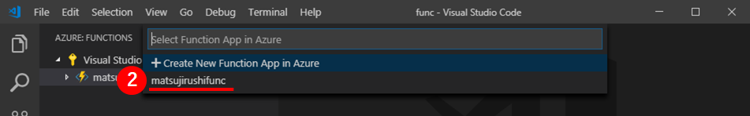

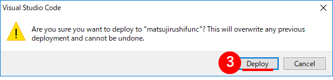

<br/>

配置(デプロイ)が始まり、正常に終了すると、以下のようになります。

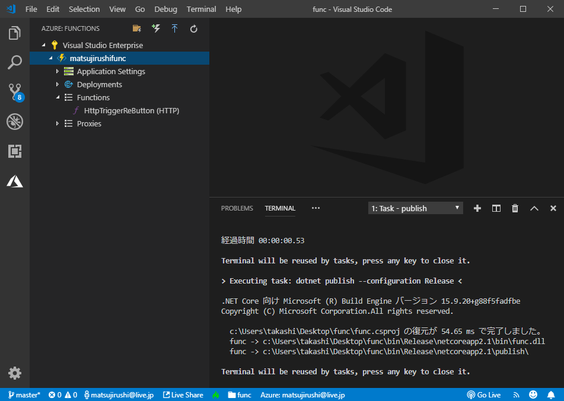

---

### <a name="4-4">3-3-4 IoTC : ルールを追加</a>
<b><font color=RED>ここ修正必要</font></b>

|この節での実施概要|
|:--|
|Azure IoT Centralに戻って、作成したAzure Function Appに接続するためのルールを追加します。|

<br/>

最初に配置(デプロイ)が終了したFunction Appの①`自分が作成したFunction name`を右クリックし、②`Copy Function Url`をクリックしてURLをコピーしておきます。

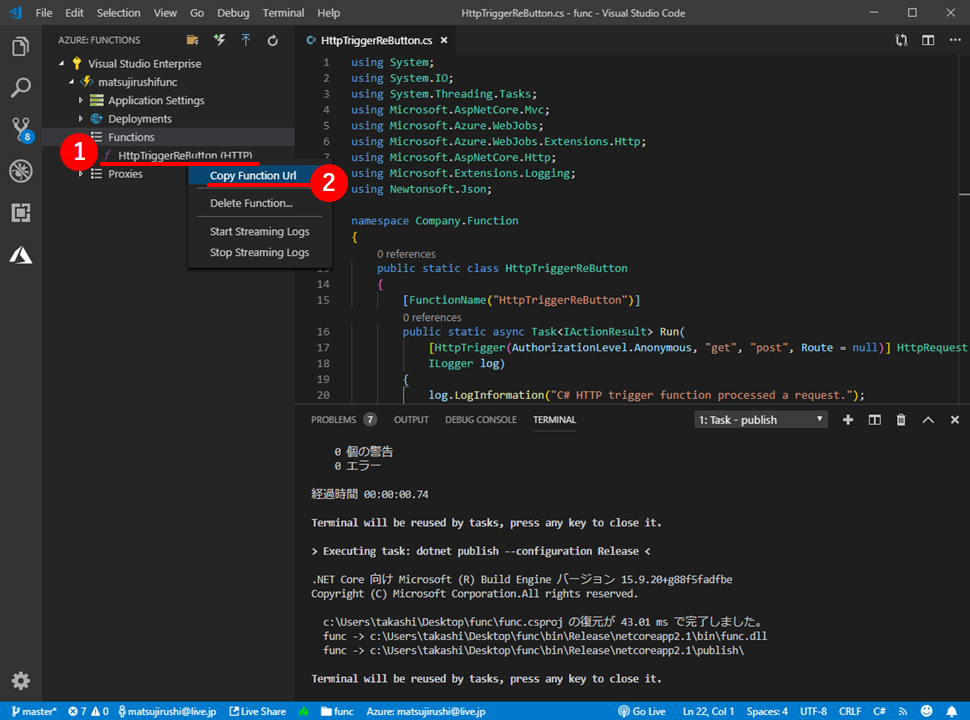

<br/>

3章でやったのと同じように、Azure IoT Central上で、左の①`デバイステンプレート`をクリックして、②`ReButton`デバイステンプレートをクリックしてください。

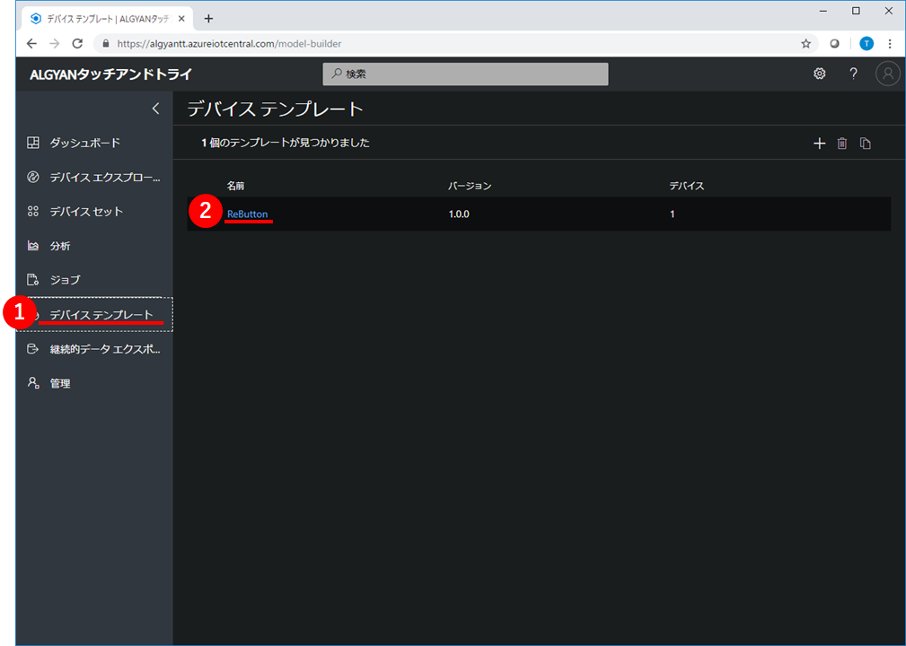

<br/>

デバイステンプレートの測定タブ画面から、①`ルール`をクリックして、ルールタブ画面を表示します。  
続いて、②`新しい規則`をクリックし、さらに③`イベント`をクリックしてください。

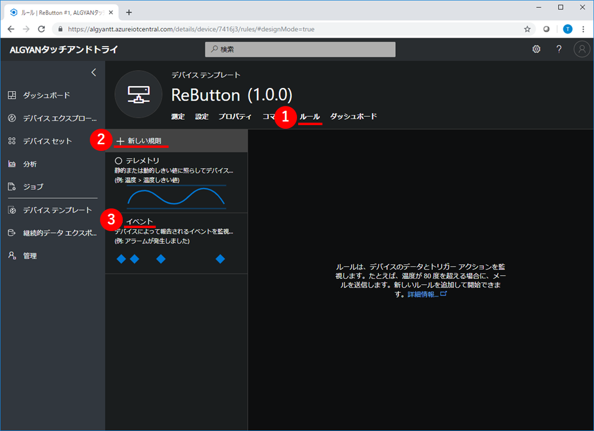

<br/>

イベントルールを構成する画面が表示されます。
ここで、下表のとおり設定して、最後に④`保存`をクリックしてください。

|項目名|値|備考|
|:--|:--|:--|
|①名前|==任意==|functions|
|③測定|メッセージ|②[`+`]をクリックして、`条件`を展開した上で、選択します|

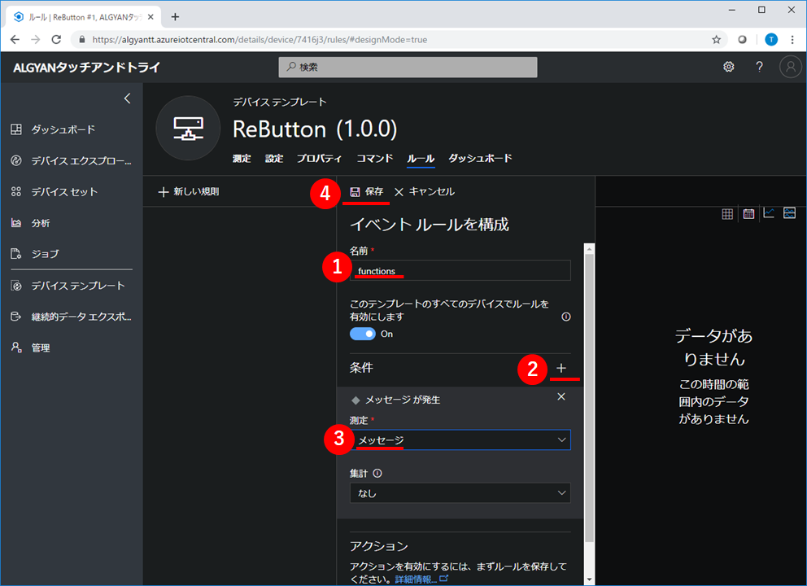

<br/>

次に、アクションの右の①[`+`]をクリックし、右に表示されるアクションの選択の中から②`Webhook`をクリックします。  

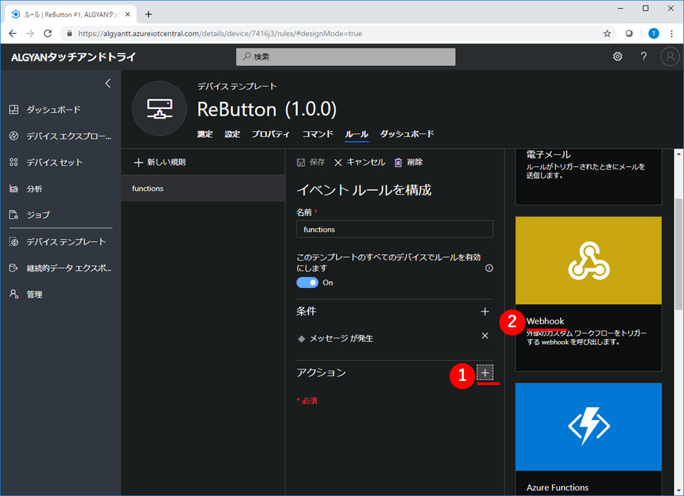

<br/>

最後に、コールバックURLに、先にAzure Function Appでコピーした①`(自分のFunction URL)`を貼り付けし、②`保存`をクリックして、ルールの追加が終了です。

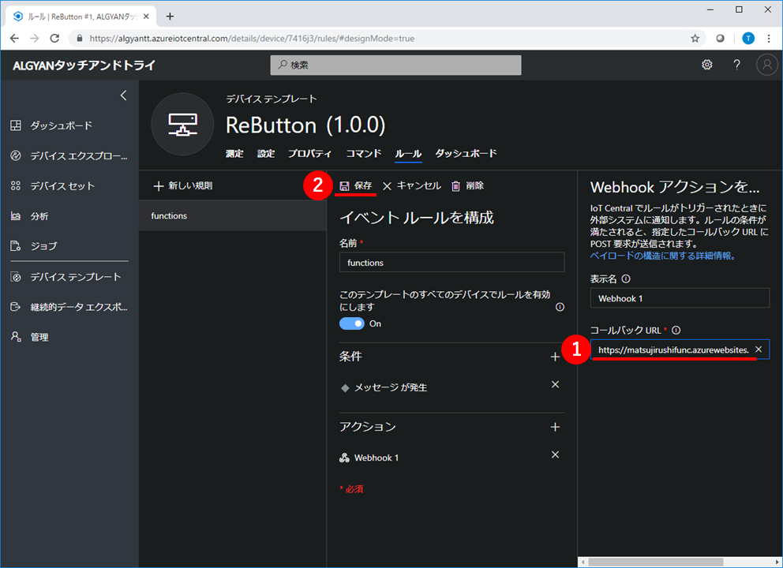

---

### <a name="4-5">3-3-5 VSCode : コードのログをモニタリング</a>
<b><font color=RED>ここ修正必要</font></b>

|この節での実施概要|
|:--|
|VS Codeを使って、Azure Function Appサンプルの実行を確認します。|

<br/>

VS Codeにて、最初に配置(デプロイ)が終了したFunction Appの①`自分が作成したFunction name`を右クリックし、②`Start Streaming Logs`をクリックしてストリーミングログを開始しておきます。

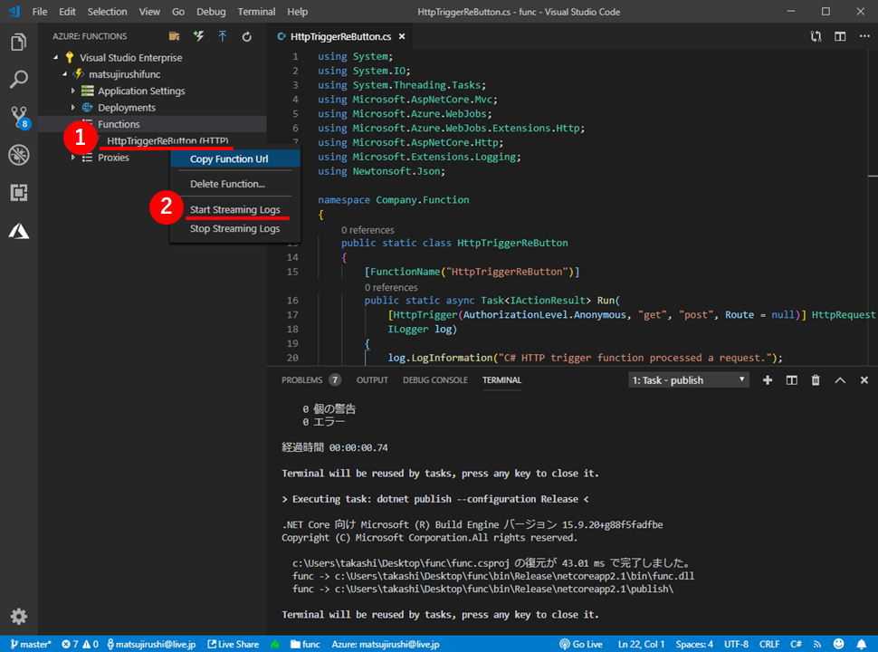

<br/>

**さあ、ボタンを押してみましょう！**

SMS通知の確認のときと同じように、ボタンを押します。

|【注意！】| LED(白)になるまで、ボタンを押し続けた場合は、<br>最初の設定で行ったAccess Pointモードになってしまいます。<br>この場合は、一度裏ぶたを開けて、電池を抜き差しして、<br>Access Pointモードを解除し、元に戻してください。|
|:--|:--|

VS CodeのOUTPUTビューに、Function App実行時の出力が表示されます。  
このとき、デバイステンプレートの測定画面に表示されるタイミングとストリーミングログに表示されるタイミングは異なります。  
またストリーミングログに表示されるメッセージは、ReButtonのボタンの押し方が違っても同一です。

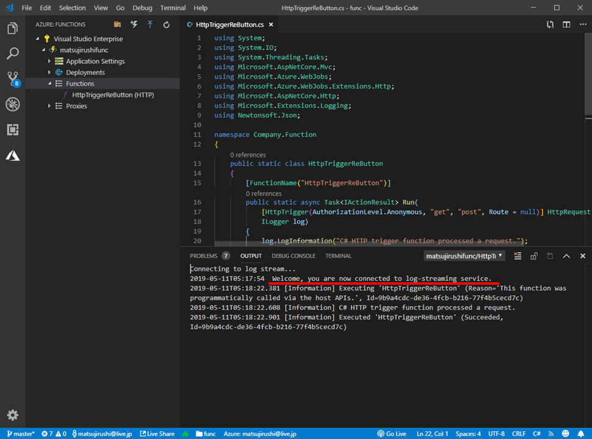

---
