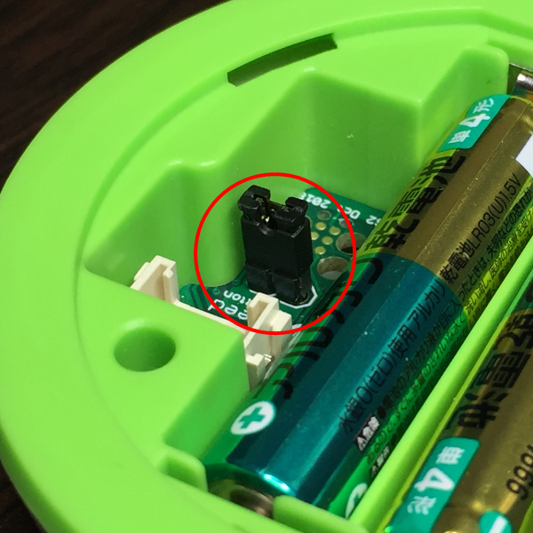
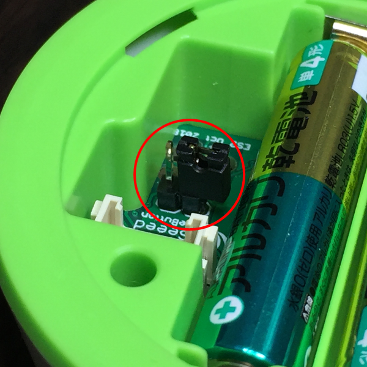
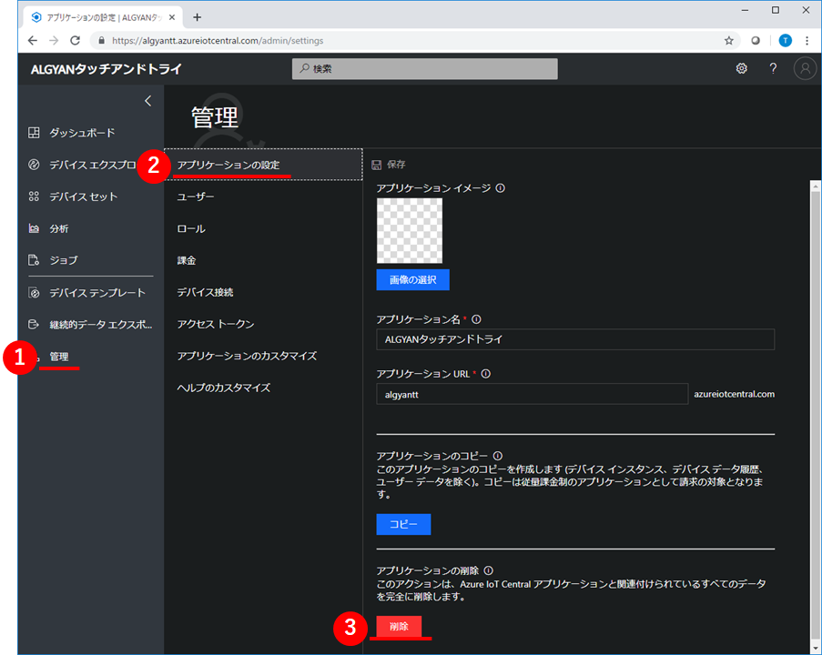
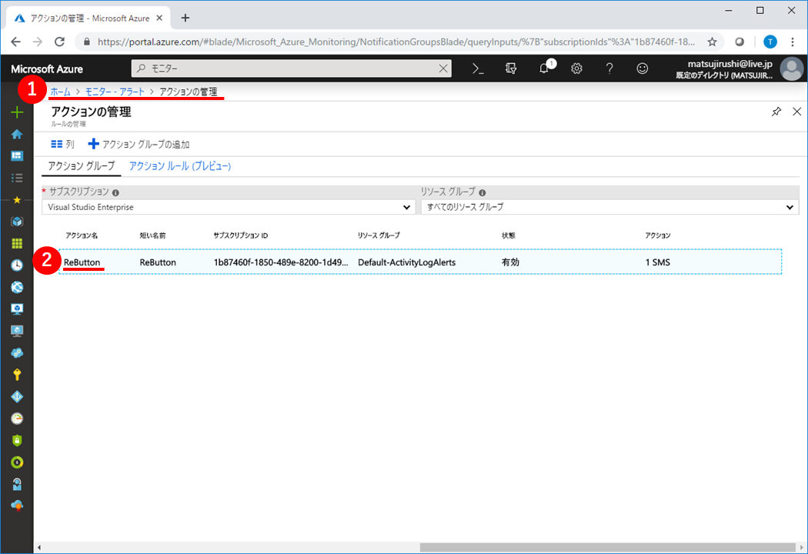
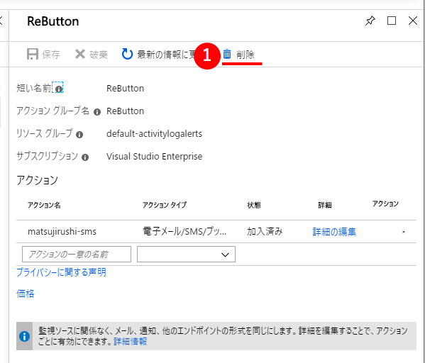
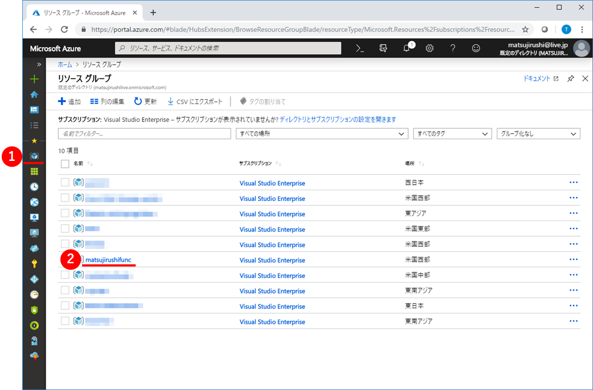
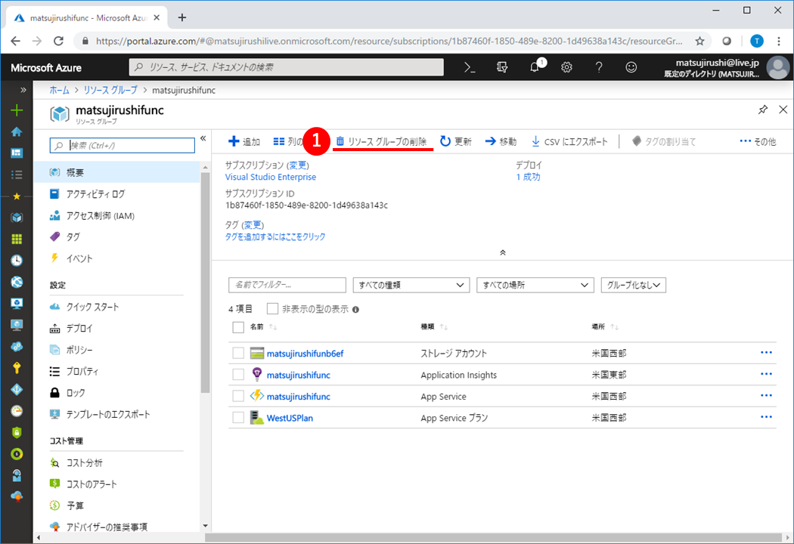
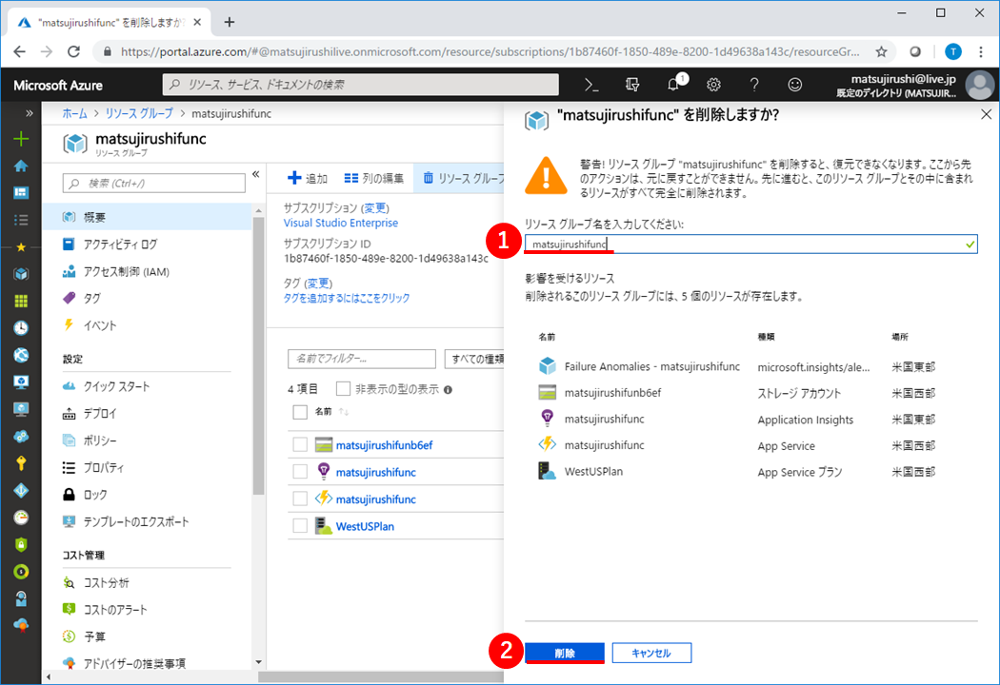

# タッチアンドトライ ~ ReButton ~

## 謝辞

本テキストは、[ReButton+IoT Central体験『 IoT タッチ＆トライ』@de:code2019](https://algyan.connpass.com/event/130744/)のために、IoT ALGYANコミュニティ([Facebook](https://www.facebook.com/groups/ioytjp/), [twitter](https://twitter.com/IOT_ALGYAN?lang=ja), [connpass](https://connpass.com/dashboard/))の有志が協力して制作しています。

スペシャルサンクス！

* [Takashi Matsuoka](https://github.com/matsujirushi)

---

目次

* [後始末](#F-0) - 5分 <b>ここ修正必要</b>
  * [F-1 ReButton : 工場出荷時設定にリセット](#F-1)
  * [F-2 IoTC : アプリケーションを削除](#F-2)
  * [F-3 Azure : アクショングループを削除](#F-3)
  * [F-4 Azure : リソースグループを削除](#F-4)

---

## <a name="F-0">後始末</a>

### <a name="F-1">F-1 ReButton : 工場出荷時設定にリセット</a>
<b>ここ修正必要</b>
|この節での実施概要|
|:--|
|今後自分のMicrosoftアカウントに課金されないように、貸出用のReButtonに設定した自分のAzureサービスへの接続情報を、工場出荷時の設定にリセットし、消去します。|

 

ReButtonの裏ぶたを取り外してください。  
裏ぶたはシリコン製なのでグンニャリします。隙間にツメを突っ込んで引っ張り上げれば簡単に外れると思います。  
外れたら、電池の横にあるジャンパーピンを写真のように、両方のピンに刺さるようにはめて5秒程度待ちます。

> 正常にピンをはめることができていれば、表側のLEDが赤く点滅します。

> Firmwareバージョン1.5以降は、ジャンパーピンの接続だけでは工場出荷時設定にリセットされません。  
> 下記手順を実施してください。
> 1. 電池を外す
> 2. ジャンパーピンを接続
> 3. ボタンを押しながら電池を入れる
> 4. （工場出荷時設定にリセットされ）LEDが赤く点滅したら、ボタンを離す
> 5. ジャンパーピンを外す

 

その後、またジャンパーピンを写真のように、片方だけ刺さるようにはめ直します。  
これで、ReButtonの工場出荷時設定へのリセットは完了です。

---

### <a name="F-2">F-2 IoTC : アプリケーションを削除</a>

|この節での実施概要|
|:--|
|今後自分のMicrosoftアカウントに課金されないように、自分のAzure IoT Centralサービス上に作成したアプリケーションを消去します。|

 

Azure IoT Centralの画面で、①`管理`をクリックし、②`アプリケーションの設定`、③`削除`を順にクリックします。  
これで、Azure IoT Central側のアプリケーション一式が全て削除できます。

---

### <a name="F-3">F-3 Azure : アクショングループを削除</a>
<b>ここ修正必要</b>
|この節での実施概要|
|:--|
|今後自分のMicrosoftアカウントに課金されないように、自分のAzureモニターサービスに作成したアクショングループを消去します。|

 

Azureポータルの画面で、①`モニター`→`アラート`→`アクションの管理`をクリックし、②`ReButton(自分の作成したアクション名)`をクリックします。  

 

表示されたReButton(自分の作成したアクション名)の画面上部の①`ゴミ箱アイコン(削除)`をクリックします。  
作成したアクションが複数ある場合は、該当する全てのアクションに対して、同じ操作を繰り返し行います。  
これで、Azureサービス側のアクション一式が全て削除できます。

---

### <a name="F-4">F-4 Azure : リソースグループを削除</a>

|この節での実施概要|
|:--|
|今後自分のMicrosoftアカウントに課金されないように、自分のAzureサービスに作成したリソースグループを消去します。|

 

Azureポータルの画面の左端にある、①`リソースグループ`をクリックし、リソースグループ一覧を表示します。  
この一覧の中から、②`名前(自分の作成したリソースグループ名)`をクリックします。

手順通りに作業していれば、本ハンズオンでは下記のリソースグループが作成されているはずです。

|作成場所|リソースグループ名|
|---|---|
|(IoT Centralが自動生成)|IOTC|
|3章 ボタンクリックをSMS通知する/3-1 Azure : アクショングループを作成|Default-ActivityLogAlerts|
|4章 ボタンクリックからコード呼び出し/4-1 Azure : Function Appを作成|入力したアプリ名から自動生成|

 

表示されたReButton(自分の作成したアクション名)の画面上部の①`リソースグループの削除`をクリックします。  

 

リソースグループの削除確認画面が表示されるので、ここで、①`(選択したリソースグループ名)`を手入力して、②`削除`ボタンをクリックします。  
作成したリソースグループが複数ある場合は、該当する全てのリソースグループに対して、同じ操作を繰り返し行います。  
これで、Azureサービス側のリソースグループ一式が全て削除できます。

---
